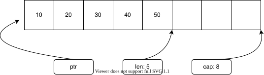

## 11. 集合

### 11.1 简介

　　在实际开发中，程序往往需要处理大量数据，并对这些数据执行查找、排序、新增、修改、删除等操作。为了高效地**存储和管理**数据，Rust 提供了多种集合类型（Collections）。这些集合采用**不同的数据组织方式和底层实现**，以适应不同应用场景的需求：有的集合侧重于提高数据查询效率，有的则更关注新增和删除操作的性能。


### 11.2 动态数组（Vec）

　　动态数组的数据组织方式与普通数组类似，都是采用线性结构组织数据，其元素存储在一块连续的内存空间中。通过数组索引，动态数组可以快速访问每个元素，因此在查询和访问操作上具有显著的性能优势。动态数组内部维护三个字段来管理内存空间：内存区域指针（`ptr`）、长度（`len`）和容量（`cap`）。其中，`ptr`指向实际存储元素的内存区域，`len`表示当前存储的元素数量，而`cap`则表示当前分配的内存容量。

　　当现有容量不足以容纳新增元素时，动态数组会自动扩容以容纳更多数据，通常采用容量翻倍的策略，以减少频繁的内存重新分配。动态数组在查询和随机访问方面表现优异，能够通过索引快速定位元素。但在插入或删除元素时，尤其不是在数组末尾进行操作时，需要移动大量数据，从而带来较大的性能开销。因此，动态数组虽然在访问性能上具有明显优势，但在需要频繁插入和删除的场景下，效率往往不如其他数据结构。

        

　　Rust 提供了多种创建动态数组的方式：使用 `Vec::new()` 创建空数组；使用 `Vec::with_capacity()` 创建具有指定初始容量的数组，适用于已知容量的场景；使用 `Vec::from()` 基于已有数组生成动态数组；而 `vec![]` 宏则提供了一种更简洁的方式，可以直接初始化并使用指定值填充动态数组。

```rust
fn main() {
    // 创建一个空的动态数组
    let vec1: Vec<i32> = Vec::new();
    println!("new: 数组容量={}, 元素数量={}", vec1.capacity(), vec1.len());

    // 基于数组创建动态数组，创建后容量和数组长度（元素数量）相等
    let array = [10, 20, 30, 40, 50];
    let vec2 = Vec::from(array);
    println!("from: 数组容量={}, 元素数量={}", vec2.capacity(), vec2.len());

    // 创建并使用指定值填充动态数组，创建后容量和数组长度相等
    let vec3 = vec![10, 20, 30, 40, 50];
    println!("vec!: 数组容量={}, 元素数量={}", vec3.capacity(), vec3.len());

    // 创建一个指定大小的动态数组，容量大小为 100，
    let vec4: Vec<i32> = Vec::with_capacity(100);
    println!("with_capacity: 数组容量={}, 元素数量={}", vec4.capacity(), vec4.len());

    // 在 64 位平台上，动态数组大小为 24 字节（ptr 指针类型、len 和 cap usize 类型）
    println!("动态数组大小: {}", size_of_val(&vec1));
}
```

```shell
shell> cargo run
new: 数组容量=0, 元素数量=0
from: 数组容量=5, 元素数量=5
vec!: 数组容量=5, 元素数量=5
with_capacity: 数组容量=100, 元素数量=0
动态数组大小: 24
```

　　集合类型通常提供一系列用于管理数据的操作接口，包括新增、删除、修改、查询和遍历等，`Vec` 也同样支持这些常用操作。

```rust
fn main() {
    // 创建并使用指定值填充动态数组
    let mut vec = vec![10, 20, 30, 40];

    // 插入数据
    vec.push(50);         // 插入到末尾
    vec.insert(0, 100);    // 插入到指定索引位置
    println!("插入数据: {:?}", vec);

    // 删除数据
    vec.remove(0);          // 删除指定索引的值
    vec.drain(1..=3);       // 批量删除，索引 1～3
    println!("删除数据: {:?}", vec);

    // 修改数据，修改指定索引的值
    vec[0] = 10;
    println!("修改数据: {:?}", vec);

    // 读取数据，获取指定索引的值
    let value1 = vec[0];
    let value2 = vec.get(0);    // 返回值是 Option，如果索引超出范围动态数组，返回 None
    println!("获取指定索引的值: {}, {}", value1, value2.unwrap());

    // 通过索引遍历数据
    for index in 0..vec.len() {
        println!("通过索引遍历数据: index={}, {:?}", index, vec.get(index));
    }

    // 通过不可变引用迭代器遍历数据
    for element in vec.iter() {
        println!("通过引用遍历数据: {}", element);
    }

    // 通过可变引用迭代器遍历数据
    for element in vec.iter_mut() {
        *element += 100;     // 修改数据，将元素加 1.0
        println!("通过可变引用遍历数据: {}", element);
    }

    // 通过获取所有权迭代器遍历数据
    for element in vec.into_iter() {
        println!("通过获取所有权遍历数据: {}", element);
    }

    // 所有权被转移，原始数组无法再访问
    // println!("{:?}", vec);
}
```

```shell
shell> cargo run
插入数据: [100, 10, 20, 30, 40, 50]
删除数据: [10, 50]
修改数据: [10, 50]
获取指定索引的值: 10, 10
通过索引遍历数据: index=0, Some(10)
通过索引遍历数据: index=1, Some(50)
通过引用遍历数据: 10
通过引用遍历数据: 50
通过可变引用遍历数据: 110
通过可变引用遍历数据: 150
通过获取所有权遍历数据: 110
通过获取所有权遍历数据: 150
```

　　动态数组在扩容时可能会带来较大的性能开销：当现有容量不足以容纳新增元素时，`Vec` 会按倍数增长容量（Rust v1.92.0）。如果当前内存空间后方没有足够的空闲连续区域，`Vec` 需要在其他位置重新分配内存，并将已有元素复制过去。当元素数量较多时，复制过程会带来较大的性能开销。因此，在已知所需容量的情况下，建议使用 `Vec::with_capacity()` 预先分配空间，以避免扩容导致的性能损失。

```rust
use std::time;

fn main() {

    // 创建一个空的动态数组，初始容量为 0
    let mut vec = Vec::new();
    println!("初始容量={}, 元素数量={}", vec.capacity(), vec.len());

    // 第一次添加元素，容量扩充为 4
    vec.push(1);
    println!("第一次扩容容量={}, 元素数量={}", vec.capacity(), vec.len());

    // 连续添加元素，超过容量时，容量翻倍扩充为 8
    vec.push(1);
    vec.push(1);
    vec.push(1);
    vec.push(1);
    println!("再次扩容容量={}, 元素数量={}", vec.capacity(), vec.len());


    // 使用 Vec::with_capacity() 预先分配空间，可以避免扩容导致的性能开销
    let count = 10_000_000;
    {
        // 未预分配容量，需要多次扩容
        let start = time::Instant::now();
        let mut vec1 = Vec::new();
        for i in 0..count {
            vec1.push(i);
        }
        println!("Vec::new() 耗时: {:?}", start.elapsed());
    }

    {
        // 预先分配容量（避免频繁扩容）
        let start = time::Instant::now();
        let mut vec = Vec::with_capacity(count);
        for i in 0..count {
            vec.push(i);
        }
        println!("Vec::with_capacity() 耗时: {:?}", start.elapsed());
    }
}
```

```shell
shell> cargo run
初始容量=0, 元素数量=0
第一次扩容容量=4, 元素数量=1
再次扩容容量=8, 元素数量=5
Vec::new() 耗时: 209.692176ms
Vec::with_capacity() 耗时: 186.665145ms
```

　　另外，在动态数组中间新增或删除数据时，也会导致较大的性能开销。这是因为插入或删除元素后，`Vec` 需要移动其他元素以保持顺序，尤其是在数组较大时，性能损耗更加明显。

```rust
use std::time;

fn main() {
    // 创建一个大小为 1 亿的动态数组
    let capacity = 100000000;
    let mut vec = Vec::with_capacity(capacity);
    vec.extend(0..capacity);   // 批量插入

    // 删除第一个元素
    let start = time::Instant::now();
    vec.remove(0);
    let end = time::Instant::now();
    println!("删除第一个元素耗时 {:?}", end - start);

    // 删除最后一个元素
    let start = time::Instant::now();
    vec.remove(vec.len() - 1);
    let end = time::Instant::now();
    println!("删除最后一个元素耗时 {:?}", end - start);

    // 删除中间元素
    let start = time::Instant::now();
    vec.remove(vec.len() / 2);
    let end = time::Instant::now();
    println!("删除中间元素耗时 {:?}", end - start);

    // 在开头插入一个元素
    let start = time::Instant::now();
    vec.insert(0, 100);
    let end = time::Instant::now();
    println!("在第一个位置插入元素耗时 {:?}", end - start);

    // 在末尾插入一个元素
    let start = time::Instant::now();
    vec.push(100);
    let end = time::Instant::now();
    println!("在最后位置插入元素耗时 {:?}", end - start);

    // 在中间插入一个元素
    let start = time::Instant::now();
    vec.insert(vec.len() / 2, 100);
    let end = time::Instant::now();
    println!("在中间位置插入元素耗时 {:?}", end - start);
}
```

```shell
shell> cargo run
删除第一个元素耗时 80.90129ms
删除最后一个元素耗时 821ns
删除中间元素耗时 46.291873ms
在第一个位置插入元素耗时 98.852552ms
在最后位置插入元素耗时 104ns
在中间位置插入元素耗时 56.636787ms
```

　　动态数组 `Vec` 会根据需要自动扩容，但**不会自动缩容**。如果删除大量元素后需要释放空闲的内存空间，可以手动调用 `shrink_to_fit()` 函数，将容量收缩至当前元素数量，或使用 `shrink_to()` 函数将容量收缩至指定大小，但不会小于当前元素数量，即 `容量 = max(n, 元素数量)`。

```rust
fn main() {
    // 创建一个容量大小为 100 的动态数组，添加元素后，使用 shrink_to_fit() 将容量收缩到当前元素数量
    let mut vec = Vec::with_capacity(100);
    vec.push(1);
    vec.shrink_to_fit();
    println!("调用 shrink_to_fit() 后容量: {}", vec.capacity());

    // 创建一个容量大小为 100 的动态数组添加元素后，使用 shrink_to() 将容量收缩至指定大小
    let mut vec = Vec::with_capacity(100);
    vec.extend(1..=10);             // 插入 10 个元素
    vec.shrink_to(vec.len() + 2);   // 如果未来还需要插入，可以预留一些余量
    println!("调用 shrink_to() 后容量: {}", vec.capacity());

    // 指定大小小于当前元素数量，最终容量等于元素数量
    vec.shrink_to(6);
    println!("调用 shrink_to(6) 后容量: {}", vec.capacity());
}
```

```shell
shell> cargo run
调用 shrink_to_fit() 后容量: 1
调用 shrink_to() 后容量: 12
调用 shrink_to(6) 后容量: 10
```


### 11.3 哈希表（HashMap）

　　哈希表（`HashMap`）同样采用线性结构来组织数据，将元素存储在一块连续的内存空间中，但访问方式并不依赖数组索引。其存储的元素由键值对（`key-value`）组成，`HashMap` 会通过哈希函数将键（`key`）转换为哈希值，并根据该哈希值计算存储位置，实现数据的快速查询与访问。

　　由于元素的存储位置由哈希值决定，其排列顺序取决于哈希值的分布，而非插入顺序，因此哈希表并不像数组那样具备有序性。但也正因如此，哈希表在任意位置进行插入或删除操作时，无需像数组那样大规模移动后续元素，随机插入和删除效率较高。

　　使用 `HashMap::new()` 函数可以创建一个空哈希表，或使用 `HashMap::with_capacity()`函数创建一个具有指定初始容量的哈希表。

```rust
use std::collections::HashMap;

fn main() {
    // 创建一个空的哈希表
    let map: HashMap<String, i32> = HashMap::new();
    println!("new: 初始容量={}, 元素数量={}", map.capacity(), map.len());

    // 创建具有预设容量的哈希表，可以减少后续插入时的扩容开销
    // 注意：HashMap 的实际分配容量通常是 2 的幂次方，且受负载因子限制
    let map: HashMap<String, String> = HashMap::with_capacity(10);
    println!("with_capacity: 初始容量={}, 元素数量={}", map.capacity(), map.len());
}
```

```shell
shell> cargo run
new: 初始容量=0, 元素数量=0
with_capacity: 初始容量=14, 元素数量=0
```

　　`HashMap` 提供一系列用于管理数据的操作接口，包括新增、删除、查询和遍历等。需要注意的是，当向哈希表中插入已存在的键时，旧的值会被新值覆盖。

```rust
use std::collections::HashMap;

fn main() {
    let mut map: HashMap<u32, &str> = HashMap::new();

    // 插入键值对，不保证元素的按插入顺序存放
    map.insert(3, "张三");
    map.insert(4, "李四");
    map.insert(5, "王五");
    println!("insert: {:?}", map);

    // 如果键已存在，insert 会更新并返回旧值
    let old_value = map.insert(3, "赵六");   // 旧值: Some("张三")
    println!("insert: {:?}, 旧值={:?}", map, old_value);

    // 条件插入，键不存在才插入
    map.entry(7).or_insert("钱七");
    println!("or_insert: {:?}", map);

    // 删除数据
    let removed_value = map.remove(&3);
    println!("remove: {:?}, 删除的数据={:?}", map, removed_value);

    // 清空数据
    // map.clear();
    // println!("clear: {:?}", map);

    // 判断数据是否存在
    let contains_key = map.contains_key(&4);
    println!("contains_key: {}", contains_key);

    // 获取数据
    let value = map.get(&4);
    println!("get: {:?}", value);

    // 获取所有 key
    let keys = map.keys();
    println!("keys: {:?}", keys);

    // 获取所有 value
    let values = map.values();
    println!("values: {:?}", values);

    // 遍历数据
    for (key, value) in map.iter() {
        println!("iter: key={}, value={}", key, value);
    }

    for (key, value) in map.iter_mut() {
        println!("iter_mut: key={}, value={}", key, value);
    }

    for (key, value) in map.into_iter() {
        println!("into_iter: key={}, value={}", key, value);
    }
}
```

```shell
shell> cargo run
insert: {4: "李四", 5: "王五", 3: "张三"}
insert: {4: "李四", 5: "王五", 3: "赵六"}, 旧值=Some("张三")
or_insert: {4: "李四", 7: "钱七", 5: "王五", 3: "赵六"}
remove: {4: "李四", 7: "钱七", 5: "王五"}, 删除的数据=Some("赵六")
contains_key: true
get: Some("李四")
keys: [4, 7, 5]
values: ["李四", "钱七", "王五"]
iter: key=4, value=李四
iter: key=7, value=钱七
iter: key=5, value=王五
iter_mut: key=4, value=李四
iter_mut: key=7, value=钱七
iter_mut: key=5, value=王五
into_iter: key=4, value=李四
into_iter: key=7, value=钱七
into_iter: key=5, value=王五
```

　　`HashMap` 的键（Key）必须实现 `Hash` 和 `Eq` trait。其中，`Hash` trait 用于计算键的哈希值，`Eq` trait 用于判断键之间的相等性。当插入新数据时，如果两个键的哈希值相同且经过相等性比较后判定为同一个键，新值会覆盖旧值，避免重复键的出现，即**键不会重复**。

```rust
use std::collections::HashMap;
use std::hash::{Hash, Hasher};

// 自定义结构体
#[derive(Debug)]
struct User {
    id: u32,
    name: String,
}

// 为 User 实现 Hash trait
impl Hash for User {
    fn hash<H: Hasher>(&self, state: &mut H) {
        // 计算哈希值时，使用 id 和 name 字段
        self.id.hash(state);
        self.name.hash(state);
    }
}

// 为 User 实现 PartialEq 和 Eq trait
impl PartialEq for User {
    fn eq(&self, other: &Self) -> bool {
        // 判断字段必须与 hash() 函数统一
        self.id == other.id && self.name == other.name
    }
}

impl Eq for User {}

fn main() {
    // 创建一个 HashMap，键是 User，值是 u32
    let mut map: HashMap<User, u32> = HashMap::new();

    // 创建两个 User 实例
    let user1 = User { id: 1, name: String::from("张三") };
    let user2 = User { id: 2, name: String::from("李四") };
    let user3 = User { id: 1, name: String::from("张三") }; // 与 user1 相同

    // 插入元素
    map.insert(user1, 10);
    map.insert(user2, 20);
    map.insert(user3, 30); // 由于 user3 与 user1 相同，不会插入新值

    for (key, value) in &map {
        println!("User ID: {}, Name: {}, Value: {}", key.id, key.name, value);
    }
}
```

```shell
shell> cargo run
User ID: 1, Name: 张三, Value: 30
User ID: 2, Name: 李四, Value: 20
```

　　`HashMap` 在扩容时会产生一定的性能开销。当容量不足以容纳新增元素时，它会自动扩容：重新计算哈希值、复制已有元素并插入新位置。为了避免频繁扩容带来的性能损失，在已知所需容量的情况下，可以通过 `with_capacity()` 预先分配空间。需要注意的是，`HashMap` 不会自动缩容，若希望释放多余的内存空间，则需手动调用 `shrink_to()` 或 `shrink_to_fit()`。


### 11.4 哈希集合（HashSet）

　　`HashSet` 基于哈希表实现，其底层结构是 `HashMap<K, ()>`，但仅使用键（`key`）来存储数据，值固定为没有实际值的单元类型 `()`。其特性与 `HashMap` 基本一致：查询效率高、不具备有序性、插入与删除操作也较为高效。同时，`HashSet` 会自动保证元素的唯一性，即不允许存在重复元素。此外，集合中的元素类型必须实现 `Hash` 和 `Eq` trait，以支持哈希计算与相等性比较。`HashSet` 也提供了一系列用于管理数据的操作接口，且接口与 `HashMap` 类似。

```rust
use std::collections::HashSet;

fn main() {
    let mut set: HashSet<&str> = HashSet::new();

    // 插入元素，不保证元素的按插入顺序存放
    set.insert("张三");             // 单条插入
    set.extend(["李四", "王五"]);    // 批量插入
    println!("insert: {:?}", set);

    // 如何元素已存在，无法插入
    let is_inserted = set.insert("张三");   // 返回值: false
    println!("insert: {:?}, 是否插入成功={}", set, is_inserted);

    // 替换指定值，不存在则插入，存在则返回被替换的值
    let replaced = set.replace("张三");
    println!("replace: {:?}, 被替换的值={:?}", set, replaced);

    // 删除元素
    let removed = set.remove("李四");
    println!("remove: {:?}, 是否删除成功={}", set, removed);

    // 清空数据
    // set.clear();
    // println!("clear: {:?}", set);

    // 判断元素是否存在
    let contains = set.contains("王五");
    println!("contains: {}", contains);

    // 获取数据
    let value = set.get("张三");
    println!("get: {:?}", value);

    // 遍历集合
    for value in &set {
        println!("iter: {}", value);
    }

    for value in set.into_iter() {
        println!("into_iter: {}", value);
    }
}
```

```shell
shell> cargo run
insert: {"王五", "张三", "李四"}
insert: {"张三", "王五", "李四"}, 是否插入成功=false
replace: {"张三", "王五", "李四"}, 被替换的值=Some("张三")
remove: {"张三", "王五"}, 是否删除成功=true
contains: true
get: Some("张三")
iter: 张三
iter: 王五
into_iter: 张三
into_iter: 王五
```


### 11.5 双向链表（LinkedList）

　　双向链表的数据组织方式与动态数组和哈希表截然不同，链表的元素并不存储在一块连续的内存空间中，而是由多个分散的节点（`Node`）组成。每个节点包含三个部分：元素值（`elem`）、前一个节点指针（`prev`）和后一个节点指针（`next`）。通过这两个指针，链表可以高效地在任意位置插入或删除元素，而无需像动态数组那样移动大量数据，也不存在扩容性能开销问题。

　　虽然双向链表的数据组织方式在插入和删除操作上具有显著优势，但在查询（如查找某个特定元素）时的性能却不如动态数组或哈希表。这是因为链表不支持通过索引或哈希直接访问元素，查询操作需要从头或尾开始遍历，直到找到目标元素。

　　`LinkedList` 同样提供一系列用于管理数据的操作接口，包括新增、删除、查询和遍历等。由于不依赖连续内存且不存在扩容问题，因此未提供 `with_capacity` 等预分配相关接口。

```rust
use std::collections::LinkedList;

fn main() {
    let mut list: LinkedList<i32> = LinkedList::new();
    println!("链表元素数量：{}", list.len());

    // 从头部/尾部插入
    list.push_front(1);
    list.push_back(2);
    list.push_back(3);
    list.push_front(0);
    println!("push: {:?}", list);

    // 弹出头部/尾部元素
    let front = list.pop_front();
    let back = list.pop_back();
    println!("pop: {:?}, pop_front={:?}, pop_back={:?}", list, front, back);

    // 获取头尾/尾部元素
    let front = list.front();
    let back = list.back();
    println!("front: {:?}, back: {:?}", front, back);

    let front_mut = list.front_mut();
    println!("front_mut: {:?}", front_mut);

    let back_mut = list.back_mut();
    println!("back_mut: {:?}", back_mut);

    // 从头开始遍历
    for v in list.iter() {
        println!("iter: {}", v);
    }
    // 从尾开始遍历（反向迭代）
    for v in list.iter().rev() {
        println!("rev iter: {}", v);
    }

    for v in list.iter_mut().rev() {
        println!("rev iter_mut: {}", v);
    }

    for v in list.into_iter().rev() {
        println!("rev into_iter: {}", v);
    }
}
```

```shell
shell> cargo run
链表元素数量：0
push: [0, 1, 2, 3]
pop: [1, 2], pop_front=Some(0), pop_back=Some(3)
front: Some(1), back: Some(2)
front_mut: Some(1)
back_mut: Some(2)
iter: 1
iter: 2
rev iter: 2
rev iter: 1
rev iter_mut: 2
rev iter_mut: 1
rev into_iter: 2
rev into_iter: 1
```
