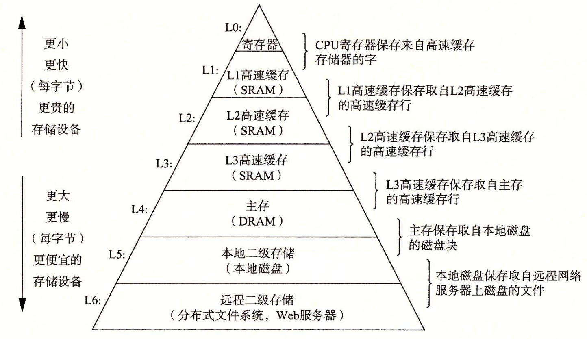

## 14. 多线程

### 14.1 简介

　　随着计算机的发展，CPU 的执行速度越来越快，而程序在运行过程中经常需要等待 I/O 操作（如用户输入、磁盘读写、网络通信等）完成。在这些等待期间，CPU 往往处于闲置状态，导致计算资源浪费。为充分利用 CPU，操作系统引入了多任务处理机制，允许在单个 CPU 上同时运行多个程序，即**并发执行**。当一个进程因等待 I/O 而阻塞时，操作系统会调度另一个处于就绪状态的进程执行，使 CPU 始终保持忙碌，从而显著提升系统的整体吞吐量和资源利用率。

　　随着 CPU 主频的不断提升逐渐接近功耗和散热瓶颈，单纯依靠提高单核性能已难以继续大幅提升计算能力。为进一步提高系统性能，硬件厂商开始采用多核处理器（Multi-Core Processor）和多处理器系统（Multi-Processor System）设计，将多个计算核心集成到同一台计算机中。这样，不同任务不仅可以通过时间片轮换交替执行，还能够在多个核心上真正同时运行，即实现**并行执行（Parallelism）**，从而显著提升计算效率和系统吞吐量。

　　每个正在运行的程序称为一个进程（Process），它是操作系统分配资源的基本单位，涉及的资源包括 CPU 执行时间、内存空间、I/O 设备等核心硬件资源。操作系统通过对进程的管理，实现对计算资源的合理分配与高效利用，同时为用户提供多任务并发/并行执行的能力。

　　进程作为资源分配单位，其创建、销毁和切换都需要较高的系统开销。当程序需要同时执行多个任务时，如果为每个任务都创建一个独立进程，不仅资源消耗较大，而且进程间通信也较为复杂。为此，操作系统进一步引入了**线程（Thread）**的概念。线程是 CPU 调度和执行的基本单位，同一进程内的多个线程共享进程的内存空间（包括堆、只读数据区、可写数据区和 BSS 段以及其他区域），但**各自拥有独立的栈空间和执行上下文**，从而能够以更低的开销实现并发执行。


### 14.2 线程操作

　　Rust 可执行程序在运行时，默认至少包含一个线程，即**主线程（main thread）**，用于执行 `main` 函数中的代码。当程序需要同时处理多个任务时，可以通过 `std::thread` 模块创建、销毁和管理线程，以更充分地利用多核 CPU 资源，提升程序的并发执行能力与整体性能。


#### 14.2.1 创建线程

　　通过 `std::thread`  模块的 `spawn()` 函数可以创建一个线程，该函数接受一个闭包作为参数，并在新线程中执行该闭包内的代码，通过 `spawn()` 创建的线程称为子线程或工作线程。子线程与主线程共享所在进程的内存空间，但拥有独立的栈和执行上下文，从而能够同时执行不同任务，实现并发或并行运行。

```rust
use std::thread;
use std::time::Duration;

fn main() {
    // 创建一个子线程
    let _join_handle = thread::spawn(|| {
        println!("子线程：你好");
    });

    // 睡眠等待子线程执行
    thread::sleep(Duration::from_secs(5));

    println!("主线程：你好");
}
```

```shell
shell> cargo run
子线程：你好
主线程：你好
```

　　另外，还可以使用 `thread::Builder` 类型以更灵活地创建和配置线程，例如设置线程名称、线程栈大小等，以满足更复杂的线程控制需求。线程创建成功后，同样会返回一个 `JoinHandle` 类型对象，通过该对象，可以获取线程相关信息、判断线程是否已执行完毕，以及等待子线程执行完毕并获取返回值等。

```rust
use std::thread;

fn main() {
    // 创建线程
    let handle = thread::Builder::new()
        .name("子线程".to_string())     // 设置线程名称
        .stack_size(1024 * 1024 * 10)  // 设置栈大小为 10MB
        .spawn(|| {
            let sum: u64 = (1..=100000).sum();
            return sum;
        }).unwrap();

    // 获取线程信息
    let thread = handle.thread();
    println!("线程ID：{:?}, 线程名称：{:?}", thread.id(), thread.name());

    // 子线程是否执行完毕
    println!("子线程是否执行完毕: {}", handle.is_finished());

    // 等待子线程执行完毕，并获取返回值
    match handle.join() {
        Ok(v) => println!("子线程执行完毕: {}", v),
        Err(e) => println!("子线程执行出错： {:?}", e),
    }
}
```

```shell
shell> cargo run
线程ID：ThreadId(2), 线程名称：Some("子线程")
子线程是否执行完毕: false
子线程执行完毕: 5000050000
```


#### 14.2.2 线程挂起与唤醒

　　在线程执行过程中，可能需要等待某些资源或条件，此时可以暂时挂起线程，直到特定条件成立后再唤醒线程并恢复执行。Rust 标准库提供了 `thread.park()` 和 `thread.unpark()` 函数，分别用于挂起当前线程和唤醒指定线程。

```rust
use std::thread;
use std::time::Duration;

fn main() {
    let handle = thread::spawn(|| {
        println!("子线程挂起...");
        thread::park();           // 挂起线程，等待 unpark
        println!("子线程恢复执行");
    });

    // 主线程休眠 5 秒
    thread::sleep(Duration::from_secs(5));
    println!("主线程发出唤醒信号");
    handle.thread().unpark();     // 唤醒子线程

    handle.join().unwrap();
}
```

```shell
shell> cargo run
子线程挂起...
主线程发出唤醒信号
子线程恢复执行
```

　　如果在线程调用 `park()` 之前，其他线程就先调用了该线程的 `unpark()` 方法，那么 `unpark()` 设置的唤醒标记会被保留下来。当该线程随后执行 `park()` 时，会立即消耗这个标记并直接返回，而不会进入阻塞状态。

```rust
use std::thread;
use std::time::Duration;

fn main() {

    let handle = thread::spawn(|| {
        println!("子线程启动");

        // 休眠等待主线程执行 unpark
        thread::sleep(Duration::from_secs(5));

        println!("子线程准备挂起...");
        thread::park();             // 立即消耗之前的 unpark
        println!("子线程执行完成");
    });

    // 子线程尚未调用 park(), 主线程先调用 unpark()
    handle.thread().unpark();
    println!("主线程已调用 unpark");

    handle.join().unwrap();
}
```

```shell
shell> cargo run
主线程已调用 unpark
子线程启动
子线程准备挂起...
子线程执行完成
```

　　需要注意的是，`park()` 底层依赖操作系统的线程挂起与唤醒机制实现。为了提高效率，操作系统通常允许线程在没有收到明确唤醒信号的情况下从阻塞状态返回，这被称为虚假唤醒（Spurious Wakeup）。也就是说，线程即使没有收到对应的 `unpark()` 调用，也有可能从 `park()` 中返回。因此，不能将 `park()` 的返回直接视为条件已经满足，而应当在循环中反复检查共享状态或条件变量。

```rust
use std::sync::atomic::{AtomicBool, Ordering};
use std::sync::Arc;
use std::thread;
use std::time::Duration;

fn main() {

    // 共享标志：用于判断条件是否满足
    // 注：AtomicBool 可以先当作普通的 bool 变量使用，详情见 14.5.1 章节
    let ready = Arc::new(AtomicBool::new(false));
    let ready_clone = Arc::clone(&ready);

    let handle = thread::spawn(move || {
        // 循环检查条件，直到条件满足为止
        while !ready_clone.load(Ordering::Acquire) {
            println!("子线程：条件未满足，挂起等待");
            thread::park(); // 可能发生虚假唤醒，所以醒来后重新检查条件
        }
        println!("子线程：条件已满足，继续执行");
    });

    // 模拟主线程进行一些准备工作
    println!("主线程：正在准备工作...");
    thread::sleep(Duration::from_secs(2));

    // 条件满足，设置标志并唤醒子线程
    ready.store(true, Ordering::Release);
    println!("主线程：条件已满足，唤醒子线程");
    handle.thread().unpark();

    handle.join().unwrap();
}
```

```shell
shell> cargo run
主线程：正在准备工作...
子线程：条件未满足，挂起等待
主线程：条件已满足，唤醒子线程
子线程：条件已满足，继续执行
```


#### 14.2.3 线程安全问题

　　虽然多线程可以提高程序的执行效率与资源利用率，但当存在共享资源时，由于并发或并行执行的特性，不同线程的生命周期可能不一致，可能会导致资源提前释放或尚未初始化完成就被访问的问题；另外，当其中一个或多个线程对该共享数据执行写操作时，可能会产生数据竞争问题，进而导致数据覆盖、数据撕裂以及读取到过期值等异常现象。此外，由于执行时序的不确定性，以及存储层级结构中寄存器、CPU 私有缓存（Cache）和 Store Buffer 等机制的存在，不同线程对同一数据的修改可能无法立即对其他线程可见，从而产生数据不一致问题。

　　上述问题的本质在于多线程环境下对共享状态的并发访问缺乏有效同步，这类问题被统称为线程安全问题。为解决这些问题，通常需要借助同步与并发控制机制，例如线程作用域、内存屏障、编译器屏障、原子变量、互斥锁、读写锁和 Channel 等，从不同层面控制线程间的数据访问与执行顺序，保证共享数据的一致性以及并发操作的有序性。


### 14.3 生命周期不同步

　　由于各个线程的生命周期相互独立，并且可能以并发或并行的方式执行，如果线程之间存在共享资源，就可能出现资源被某个线程提前释放，而另一个线程仍在访问，或资源尚未完成初始化便被其他线程读取的情况，导致访问到无效或异常的数据状态。下述示例中，主线程与子线程共享同一资源，但由于两个线程生命周期不同步，主线程可能在子线程尚未结束对该资源的使用时提前释放该资源，从而导致子线程访问已释放的内存，即产生悬垂引用。

```rust
use std::time::Duration;
use std::thread;

fn main() {

    let number = Box::new(100);
    // 将 Box 转换为原始指针，绕开 Rust 安全检查机制
    let ptr = Box::into_raw(number) as usize;

    let thread = thread::spawn(move || {
        // 模拟耗时操作
        thread::sleep(Duration::from_millis(2000));

        // 此时共享资源被主线程释放了
        let number = unsafe { Box::from_raw(ptr as *mut i32) };
        println!("子线程：{:?}", number);    // 内存被释放后，指针变为 null，值为 0
    });

    // 主线程释放内存
    unsafe { drop(Box::from_raw(ptr as *mut i32)); }
    thread.join().unwrap();
}
```

```shell
shell> cargo run
子线程：99320048
error: process didn't exit successfully: `target\debug\app.exe` (exit code: 0xc0000374, STATUS_HEAP_CORRUPTION)
```

　　为了避免因访问共享资源时线程生命周期不一致而引发错误，Rust 提供了两种主要解决方案：其一是避免共享资源，通过 `move` 关键字将变量所有权转移至新线程或复制一份给新线程；其二是通过线程作用域`thread::scope` 将子线程的生命周期限制在作用域内，实现非全局 `'static` 生命周期的变量也能够在作用域范围内安全地跨线程共享。


#### 14.3.1 move 关键字

　　`move` 关键字用于将变量所有权转移至新线程，或将数据复制一份给新线程，避免多个线程共享同一资源。对于实现 `Copy` trait 的类型，在传入子线程时会发生按位复制，原线程仍可继续使用该变量；否则，其所有权将被转移至子线程，原线程无法继续访问该变量。

```rust
use std::thread;

fn main() {

    // i32 类型实现了 Copy trait
    let mut number: i32 = 100;

    // String 类型没有实现 Copy trait
    let text: String = String::from("Hello");

    // move 时：闭包会捕获外部变量，并根据变量类型决定行为：
    // - Copy 类型（number）发生按位复制，原变量仍可继续使用
    // - 非 Copy 类型（text）发生所有权转移，变量被移动到子线程中
    let handle = thread::spawn(move || {
        number = 200;   // 修改不会影响原线程
        println!("子线程：number={number}");
        println!("子线程：text={text}");
    });

    handle.join().unwrap();

    // Copy 类型仍然可用，因为它在闭包中被复制了一份
    println!("主线程：number={number}");

    // 编译错误：text 所有权被转移给子线程，主线程无法继续访问该变量
    // println!("主线程：text={text}");
}
```

```shell
shell> cargo run
子线程：number=200
子线程：text=Hello
主线程：number=100
```


#### 14.3.2 Send trait

　　`Send` trait 是一个标记 trait，用于表示某个类型的值可以安全地在线程之间传递，未实现该 trait 类型的变量值无法通过 `move` 转移到其他线程中。标准库中的绝大多数类型默认已实现 `Send`，只有 `Rc` 指针和原始指针等少数类型未实现。对于自定义类型，只要其所有字段都实现了 `Send`，编译器会自动为其实现 `Send` trait，无需手动实现。

```rust
use std::rc::Rc;
use std::thread;

// u32 和 String 类型都实现了 Send trait
#[allow(dead_code)]
#[derive(Debug)]
struct User{
    id: u32,
    name: String,
}

fn main() {
    // Rc 指针没有实现 Send trait，不能跨线程使传递使用
    let _rc = Rc::new(100);
    // thread::spawn(move || println!("子线程：{}", _rc));  // 编译报错

    // 自定义类型只要所有字段都实现了 Send，编译器会自动为其实现 Send trait
    let user = User{ id: 1, name: "张三".to_string() };
    thread::spawn(move || println!("user={:?}", user))
        .join().unwrap();
}
```

```shell
shell> cargo run
user=User { id: 1, name: "张三" }
```

　　对于未实现 `Send` trait 的 `Rc` 指针，若在多线程环境中需要共享数据，可以使用 `Arc` 替代 `Rc`，以实现跨线程的安全引用计数。至于原始指针，由于其完全绕过 Rust 的所有权与借用检查机制，因此需要开发者自行保证同步安全、生命周期正确性以及数据有效性。

```rust
use std::thread;
use std::sync::Arc;

fn main() {
    // 使用 Arc 原子引用计数指针换 Rc 引用计数指针，实现跨线程安全传递
    let data = Arc::new(1);

    let data_cloned = Arc::clone(&data);
    thread::spawn(move || println!("子线程：{}", data_cloned))
        .join().unwrap();

    println!("主线程：{}", data);
}
```

```shell
shell> cargo run
子线程：1
主线程：1
```


#### 14.3.3 Sync trait

　　`Sync` trait 是一个标记 trait，用于表示某个类型的不可变引用可以安全地被多个线程共享访问。Rust 标准库中的绝大多数类型默认已实现 `Sync`，只有 `Rc` 指针、`Cell`、`RefCell` 和原始指针等少数类型未实现 `Sync`。对于自定义类型，只要其所有字段都实现了 `Sync` trait，编译器会自动为其实现 `Sync` trait，无需手动实现。

　　其中，`Rc` 指针使用非原子引用计数实现共享所有权，在多线程环境下无法保证引用计数操作的原子性（见见 12.5.1 章节），因此不具备线程安全性；`Cell` 和 `RefCell` 提供内部可变性，但其内部状态更新与借用检查均未采用同步机制，无法在并发访问下保证一致性与安全性；原始指针则完全绕过 Rust 的借用检查机制，不具备任何线程安全保证，因此同样不实现 `Sync`。

```rust
use std::cell::{Cell, RefCell};
use std::thread;

// u32 和 &str 都实现了 Sync trait，编译器会自动为其实现 Sync trait
#[allow(dead_code)]
#[derive(Debug)]
struct User<'a>{
    id: u32,
    name: &'a str,
}

fn main() {
    let user = User { id: 1, name: "张三" };
    let user_ptr:&User = &user;

    let cell = Cell::new(100);
    let _cell_ptr = &cell;

    let refcell = RefCell::new(200);
    let _refcell_ptr = &refcell;

    thread::scope(|s| {
        // 实现了 Sync trait 的类型，其不可变引用可以跨线程共享
        s.spawn(|| println!("user={:?}", user_ptr));
        s.spawn(|| println!("user={:?}", user_ptr));

        // 编译报错，Cell 和 RefCell 没有实现 Sync trait，其不可变引用不能跨线程共享
        // s.spawn(|| println!("cell={:?}", _cell_ptr));
        // s.spawn(|| println!("refcell={:?}", refcell_ptr));
    });
}
```

```shell
shell> cargo run
user=User { id: 1, name: "张三" }
user=User { id: 1, name: "张三" }
```


#### 14.3.4 线程作用域

　　使用 `thread::scope()` 可以创建一个线程作用域，当作用域代码块执行结束时，会自动调用作用域内所有子线程的 `join()` 函数，等待它们执行完毕，确保所有子线程在作用域结束前完成执行。由于子线程的生命周期被严格限制在该作用域范围内，因此无需通过 `move` 转移所有权或进行数据复制，即可安全地直接借用当前作用域内的局部变量，从根本上保证被引用的数据始终有效。

```rust
use std::thread;

fn main() {

    // 创建一个普通变量，非全局 'static 生命周期
    let text = String::from("Hello");

    // 创建一个线程作用域
    thread::scope(|scope| {

        // 在作用域内创建的子线程，直接借用当前作用域内的局部变量，无需 move
        scope.spawn(|| println!("子线程: text={text}"));

        println!("主线程: 作用域结束");
    }); // 作用域结束时, 会自动调用作用域内所有子线程的 `join()` 函数，等待它们执行完毕

    println!("父线程: 所有子线程执行完毕");
    println!("父线程: text={text}");
}
```

```shell
shell> cargo run
主线程: 作用域结束
子线程: text=Hello
父线程: 所有子线程执行完毕
父线程: text=Hello
```


### 14.4 数据不一致

　　CPU 的主要作用是执行运算，其发展重点在于不断提升计算速度和处理效率；内存的主要作用是存储数据，其发展重点在于扩大存储容量、降低单位存储成本，并尽可能提高数据访问速度。随着两者发展方向的逐渐分化，CPU 与内存之间的性能差距不断扩大，使 CPU 在访问主内存时面临越来越高的访问延迟，不得不花费大量时间等待数据返回，从而限制了系统整体性能的进一步提升。

　　幸运的是，程序在运行时并非随机地访问内存，而是呈现出显著的局部性规律。研究发现，程序在一段时间内往往集中访问某一小部分数据（时间局部性），或按顺序访问相邻的内存地址（空间局部性）。这种局部性特征为缓解 CPU 与内存之间的速度鸿沟提供了突破口——通过在二者之间引入成本更高，但速度更快的中间存储层（即缓存），将近期可能被访问的数据提前载入其中，便可大幅减少 CPU 直接访问主内存的次数，从而有效隐藏内存延迟、提升系统整体性能。

- **时间局部性（Temporal Locality）**：如果某个数据被访问，那么在不久的将来它很可能会再次被访问。例如，循环中的计数器变量通常会在每次迭代中重复访问。

- **空间局部性（Spatial Locality）**：如果某个数据被访问，那么其附近的内存地址很可能在随后也会被访问。例如，数组的顺序遍历通常会依次访问相邻的元素。

　　为了在访问速度、存储容量和硬件成本之间取得平衡，现代计算机并不会仅依赖单一存储设备，而是采用存储层次结构（Memory Hierarchy）设计（见下图，来源：深入理解计算机系统）。该结构按照访问速度由快到慢、容量由小到大、单位成本由高到低的原则，将不同类型的存储设备组织成多个层次。当 CPU 访问数据时，会优先从速度最快的存储层开始查找；如果当前层未命中（Cache Miss），再逐级向下一层查找，直到获得所需数据。借助局部性原理，大部分访问请求都能够在较高层级的存储中得到满足，从而显著降低平均访问延迟，提高系统整体性能。



　　在多核处理器中，寄存器、L1 高速缓存和 L2 高速缓存通常为各核心独享的私有存储，其中的数据仅对所属核心可见；由于程序中大量线程私有数据无需共享，采用私有存储可以避免处理多核心间的竞争和同步产生的额外延迟，保证缓存的高性能。L3 高速缓存更侧重于提升多个核心之间的数据共享效率，因此通常设计为各核心的共享缓存。此外，主存以及本地或远程的二级存储也通常多为多个核心所共享，其中的数据可被各个核心访问。（注：不同 CPU 型号的缓存层次结构和缓存共享机制可能有所不同，具体以实际硬件设计为准）。

　　对于共享数据，各核心的私有缓存中都可能保留其副本。当某个核心修改共享数据后，出于性能考虑，更新可能暂时只存在于该核心的私有缓存中，导致其他核心的副本过期或失效，产生数据不一致。当其他核心继续使用这些过期副本时，可能导致逻辑判断错误、状态不一致、死循环甚至数据损坏等不可预测的问题，例如，一个线程已将任务状态更新为"完成"，而另一个线程仍从本地缓存中读取到"未完成"，从而重复执行同一任务，导致程序行为异常。这种由于不同核心的数据更新未能及时对其他核心可见而引发的问题，被称为**数据可见性问题**。


#### 14.4.1 寄存器与 volatile

　　为了提升性能，编译器在保证不改变单线程执行结果的前提下，生成机器码时可能不会每次都直接从内存读取或写回数据，而是将数据临时保存在寄存器中，以减少冗余的内存访问，降低访问主存带来的开销。由于寄存器是各核心私有的，保存其中的数据对其他核心不可见，因此在多线程环境下，这会导致一个线程对共享数据的修改可能无法及时被其他线程看到，产生数据可见性问题。

　　在下述示例中，线程 A 持续轮询共享变量 `NUM`，期望在线程 B 将其修改为大于等于 `10000` 后跳出循环。然而，在 Release 模式下编译运行，由于编译器可能将 `NUM` 的值缓存到寄存器中，并认为其在循环期间不会发生变化，从而将循环中的内存读取优化掉，导致线程 A 始终读取到寄存器中的旧值，最终无法感知线程 B 的更新，陷入死循环。

```rust
use std::thread;

static mut NUM: u32 = 0;

fn main() {

    // 线程A：循环检测全局变量 NUM 是否大于等于 10000
    let thread_a = thread::spawn(move || unsafe {

        loop {
            // NUM 在循环中未被修改，编译器可能将 NUM 缓存到寄存器，循环
            // 中不再读取内存，导致线程 A 看到的始终是旧值，陷入死循环
            let value = NUM;
            if value >= 10000 {
                println!("线程A: NUM={value}");
                return;
            }
        }
    });

    // 线程B：循环将 NUM 递增到 100_000_000
    let thread_b = thread::spawn(move || unsafe {

        for index in 0..=100_000_000 {
            NUM = index;
        }

        let value = NUM;
        println!("线程B: NUM={value}");
    });

    thread_a.join().unwrap();
    thread_b.join().unwrap();
}
```

```shell
# Rust 版本 1.95.0
shell> rustc --version
rustc 1.95.0 (59807616e 2026-04-14)

# 使用 debug 模式运行，程序执行结果看似“正常”
shell> cargo run -- --debug
线程A: NUM=10000
线程B: NUM=100000000

# 使用 release 模式运行，编译器会执行更激进的优化策略
shell> cargo run --release
线程B: NUM=100000000         # 线程 A 陷入死循环，没有任何输出
```

　　为了解决因编译器优化导致的数据可见性问题，Rust 提供了 `volatile` 访问机制。通过 `read_volatile()` 和 `write_volatile()` 函数，可以禁止编译器对特定内存地址的读写操作进行优化，确保每次访问都直接作用于对应的内存地址，而不会被优化为寄存器访问。下述示例，使用 volatile 读写变量，确保每次操作都直接访问内存，避免编译器为消除冗余内存访问所做的优化导致程序异常陷入死循环。

```rust
use std::thread;
use std::ptr;

static mut NUM: u32 = 0;

fn main() {

    // 线程A：循环检测全局变量 NUM 是否大于等于 10000
    let thread_a = thread::spawn(move || unsafe {

        loop {
            // NUM 在循环中未被修改，编译器可能将 NUM 缓存到寄存器，循环
            // 中不再读取内存，导致线程 A 看到的始终是旧值，陷入死循环
            let value = ptr::read_volatile(&raw const NUM);
            if value >= 10000 {
                println!("线程A: NUM={value}");
                return;
            }
        }
    });

    // 线程B：循环将 NUM 递增到 100_000_000
    let thread_b = thread::spawn(move || unsafe {

        for index in 0..=100_000_000 {
            ptr::write_volatile(&raw mut NUM, index);
        }

        let value = ptr::read_volatile(&raw const NUM);
        println!("线程B: NUM={value}");
    });

    thread_a.join().unwrap();
    thread_b.join().unwrap();
}
```

```shell
# 使用 release 模式运行，线程 A 可以输出执行结果，不会再陷入死循环
shell> cargo run --release
线程A: NUM=10003
线程B: NUM=100000000
```

　　除了多线程共享数据的场景外，`volatile` 的另一个典型应用是硬件设备寄存器访问。在嵌入式系统或操作系统内核开发中，像 GPIO、UART 串口控制器、DMA 控制器等硬件设备的控制寄存器通常通过内存映射 I/O （Memory-Mapped I/O，MMIO）将其控制寄存器映射到特定的内存地址，以便软件能够直接读取或写入这些寄存器来控制硬件行为。这些寄存器的值可能随硬件状态变化而变化，编译器不能对此类地址的访问优化为寄存器缓存，每次访问都必须直接读取或写入内存，否则程序可能无法正确读取硬件状态或向硬件发送控制命令。


#### 14.4.2 编译器重排与编译屏障

　　为了提升代码的执行效率和硬件资源利用率，编译器会在保证不改变单线程程序执行结果的前提下，可能会调整代码的执行顺序（即编译器重排，Compiler Reordering）——通过分析语句之间的依赖关系，将彼此独立、互不影响的内存读写与计算操作重新排列，减少 CPU 在执行过程中因数据依赖或执行顺序限制而产生的停顿与执行单元空闲时间，提升指令调度的灵活性。对于程序而言，编译器重排可能导致以下四种类型内存访问操作乱序：

- **Load→Load（读-读）：**后面的读操作在前面的读操作完成之前执行。 
- **Load→Store（读-写）：**后面的写操作在前面的读操作完成之前执行。 
- **Store→Store（写-写）：**后面的写操作在前面的写操作完成之前执行。 
- **Store→Load（写-读）：**后面的读操作在前面的写操作完成之前执行。

　　在多线程环境中，如果内存访问操作被编译器重排，可能导致各线程看到的数据状态不一致。如果关键读写操作被重排序，线程可能读取到尚未完成初始化的数据，或看到处于中间状态的值，产生数据可见性问题。

　　为了保证多线程环境下内存操作的顺序性与可见性，Rust 编译器提供编译屏障（Compiler Barrier）机制，用于限制编译阶段对指令顺序的重排：屏障之前的内存访问操作不会被编译器重排到屏障之后，屏障之后的内存访问操作也不会被重排到屏障之前，从而在编译阶段强制维持一定的执行顺序约束。在 Rust 中，可以通过 `compiler_fence()` 等接口在程序中插入编译屏障，并根据需要指定内存序（Memory Ordering），对重排序行为进行更细粒度的控制。

| 内存序 | 说明 |
| --- | --- |
| `Ordering::Acquire` | **读屏障**。确保屏障之前的读操作不会被重排到屏障之后，同时屏障之后的读写操作必须在屏障前的读完成后执行，即保证读-读（Load→Load）和读-写（Load→Store）的顺序。 |
| `Ordering::Release` | **写屏障**。确保屏障之后的写操作不会被重排到屏障之前，并且在屏障后的写操作对其他线程可见时，屏障前的写操作也已经可见，即保证写-写（Store→Store）的顺序。 |
| `Ordering::AcqRel` | **读写屏障**。等效于同时具有 Acquire 和 Release 语义，但不保证写-读（Store→Load）顺序。 |
| `Ordering::SeqCst` | **顺序一致屏障**。保证全局顺序一致性，即 Load→Load、Load→Store、Store→Store 和 Store→Load 都严格按照程序顺序执行，所有线程观察到的内存操作顺序一致。 |

　　虽然上一章节的示例是由于编译器优化将循环中的重复内存读取提升为寄存器缓存（Load Hoisting），导致后续循环不再从内存重新加载数据，使共享变量的更新对其他线程不可见。由于这种优化会影响内存访问顺序，因此可以引入编译屏障，在编译期对这类优化进行约束，阻止关键内存访问跨越屏障发生重排序，保证特定读写操作在逻辑上的先后关系不被破坏。


```rust
use std::sync::atomic::{compiler_fence, Ordering};
use std::thread;

static mut NUM: u32 = 0;

fn main() {

    // 线程A：循环检测全局变量 NUM 是否大于等于 10000
    let thread_a = thread::spawn(move || unsafe {

        loop {
            // 在读内存操作前面插入 Acquire 屏障，防止编译器为优化循环性能
            // 而消除重复内存读取，将变量访问提升到循环外并缓存到寄存器中。
            compiler_fence(Ordering::Acquire);
            let value = NUM;
            if value >= 10000 {
                println!("线程A: NUM={value}");
                return;
            }
        }
    });

    // 线程B：循环将 NUM 递增到 100_000_000
    let thread_b = thread::spawn(move || unsafe {

        for index in 0..=100_000_000 {
            // 在写内存操作前面插入 Release 屏障，防止编译器将变量写操作提升到循环外，
            // 直接赋值为循环结果值 100_000_000
            compiler_fence(Ordering::Release);
            NUM = index;
        }

        let value = NUM;
        println!("线程B: NUM={value}");
    });

    thread_a.join().unwrap();
    thread_b.join().unwrap();
}
```

```shell
# 使用 release 模式运行时，与使用 volatile 类似，线程 A 也不会再陷入死循环
shell>  cargo run --release
线程A: NUM=10012
线程B: NUM=100000000
```


#### 14.4.3 处理器乱序执行与内存屏障

　　为了提升 CPU 指令吞吐率和整体运行效率，CPU 会在保证不改变单线程程序执行结果的前提下，动态调整指令的执行顺序——通过分析指令间的依赖关系，提前执行那些不依赖于前一条结果的指令，从而减少因等待前序结果或资源冲突而产生的空闲时间，最大限度地利用指令流水线，提升指令吞吐率。对于程序而言，乱序执行也可能导致以下四种类型内存访问操作乱序：Load→Load、Load→Store、Store→Store 以及 Store→Load。在多线程环境中，这种 CPU 层面的乱序与编译器重排类似，也可能导致各线程观察到的数据状态不一致，从而引发数据可见性问题以及难以复现的并发错误。

　　另外，在多核处理器中，即使 CPU 严格按照程序顺序执行指令，内存访问顺序同样可能出现乱序。CPU 中的 L1 缓存和 L2 缓存通常是每个核心的私有缓存，仅允许该核心访问，当多个核心同时缓存同一份共享数据时，如果某个核心对该数据进行修改，为了保持各核心数据一致，处理器会根据缓存一致性协议（如 MESI 协议）向其他核心发送**失效请求（Invalidate Request）**，使它们缓存中的对应数据副本失效。只有收到所有核心的失效响应后，该核心才能将更新后的数据写入本地缓存，从而保证各核心数据一致。

　　等待所有失效响应会带来较高的访问延迟，尤其是在核心数量较多时更为显著。为降低因等待产生的性能损失，现代处理器引入了**写缓冲区（Store Buffer）**机制。在执行写操作时，处理器不会立即将数据写入缓存，而是先将其暂存于 Store Buffer 中，从而无需阻塞等待其他核心的失效响应，继续执行后续指令。当所有失效响应到达后，Store Buffer 中的数据才被提交至本地缓存，完成最终的数据更新。然而，其他核心可能无法及时处理失效请求，且 Store Buffer 容量有限，一旦占满就会阻塞新的写操作，影响执行效率。为缓解这一问题，现代处理器引入了**失效队列（Invalidate Queue）**。核心收到失效请求后，可将其暂存于失效队列中并立即返回响应，后续再适时更新缓存状态。这种设计减少了 Store Buffer 因等待失效响应而造成的阻塞，避免积压溢出，从而提升整体并行处理效率。

　　当某个核心将数据写入 Store Buffer 但尚未提交至本地缓存时，该写入结果尚未对其他核心可见；其他核心访问同一内存地址时，仍可能从各自缓存中读取到旧的数据副本。即使 Store Buffer 中的数据已经提交至本地缓存，如果其他核心尚未处理其 Invalidate Queue 中对应的失效请求，那么这些核心缓存中的旧缓存行仍可能保持有效，读取到的依然是旧数据。因此，不同核心所"看到"的内存操作顺序可能与程序顺序不一致，出现**内存访问乱序**。

　　不同处理器架构对内存访问乱序的允许程度并不相同。例如，x86 架构对内存访问顺序施加了较强约束，仅允许发生 Store→Load 重排序，因此通常被称为强内存模型（Strong Memory Model）；而 ARM 和 RISC-V 架构对内存访问顺序的约束相对宽松，允许 Load→Load、Load→Store、Store→Store 和 Store→Load 等多种类型的重排序，因此通常被称为弱内存模型（Weak Memory Model）。

　　下述是一个 Store-Load 乱序示例，两个线程分别向各自的标志变量写入数据，并读取对方的标志。由于写入操作滞留在各自的 Store Buffer 中而尚未对其他核心可见，后续的读取指令可能先于写入操作全局生效，从而产生乱序执行现象。结果是，双方在读取时都可能观察到旧值，导致 `data_a == 0 && data_b == 0` 成立，程序的实际执行结果与逻辑预期不一致。

```shell
共享变量:
    FLAG_A = 0
    FLAG_B = 0
    DATA_A = 0
    DATA_B = 0

线程 A:
    FLAG_A = 1          // 写入标志可能仅在 Store Buffer 中，导致后续读取操作先生效，发生乱序
    DATA_A = FLAG_B     // 读取线程 B 的标志（可能读取到旧值 0）

线程 B:
    FLAG_B = 1          // 写入标志可能仅在 Store Buffer 中，导致后续读取操作先生效，发生乱序
    DATA_B = FLAG_A     // 读取线程 A 的标志（可能读取到旧值 0）

执行结果（可能出现）:
DATA_A == 0 && DATA_B == 0  // 双方都未看到对方的写入，导致判断条件结果异常
```

```rust
use std::process::exit;
use std::sync::atomic::{AtomicBool, AtomicI32, Ordering};
use std::thread;

// 共享标志变量
static FLAG_A: AtomicI32 = AtomicI32::new(0);
static FLAG_B: AtomicI32 = AtomicI32::new(0);

// 观测结果
static DATA_A: AtomicI32 = AtomicI32::new(0);
static DATA_B: AtomicI32 = AtomicI32::new(0);

// 用于主线程与子线程同步
static THREAD_A_DONE: AtomicBool = AtomicBool::new(false);
static THREAD_B_DONE: AtomicBool = AtomicBool::new(false);

fn main() {
    // 线程 A：写 FLAG_A=1，然后读 FLAG_B
    thread::spawn(|| {
        loop {
            // 等待主线程通知开始
            while THREAD_A_DONE.load(Ordering::Acquire) {}

            FLAG_A.store(1, Ordering::Relaxed);
            let observed_b = FLAG_B.load(Ordering::Relaxed);
            DATA_A.store(observed_b, Ordering::Relaxed);

            THREAD_A_DONE.store(true, Ordering::Release);
        }
    });

    // 线程 B：写 FLAG_B=1，然后读 FLAG_A
    thread::spawn(|| {
        loop {
            // 等待主线程通知开始
            while THREAD_B_DONE.load(Ordering::Acquire) {}

            FLAG_B.store(1, Ordering::Relaxed);
            let observed_a = FLAG_A.load(Ordering::Relaxed);
            DATA_B.store(observed_a, Ordering::Relaxed);

            THREAD_B_DONE.store(true, Ordering::Release);
        }
    });

    // 主线程：反复运行测试
    for i in 1..=10_000_000 {
        // 重置共享状态
        FLAG_A.store(0, Ordering::Relaxed);
        FLAG_B.store(0, Ordering::Relaxed);
        DATA_A.store(0, Ordering::Relaxed);
        DATA_B.store(0, Ordering::Relaxed);

        // 重置完成标志，通知子线程开始
        THREAD_A_DONE.store(false, Ordering::Release);
        THREAD_B_DONE.store(false, Ordering::Release);

        // 等待两个子线程完成本轮写入
        while !THREAD_A_DONE.load(Ordering::Acquire) {}
        while !THREAD_B_DONE.load(Ordering::Acquire) {}

        let data_a = DATA_A.load(Ordering::Relaxed);
        let data_b = DATA_B.load(Ordering::Relaxed);

        // 检查是否出现双向乱序：双方都读到 0
        if data_a == 0 && data_b == 0 {
            println!("第 {} 次出现内存乱序：DATA_A = {}, DATA_B = {}", i, data_a, data_b);
            exit(0);
        }
    }

    println!("未观察到乱序行为");
}
```

```shell
shell> cargo run
第 7 次出现内存乱序：DATA_A = 0, DATA_B = 0

shell> cargo run
第 12 次出现内存乱序：DATA_A = 0, DATA_B = 0
```

　　为了保证多线程间内存操作的可见性和顺序性，现代 CPU 普遍提供了内存屏障（Memory Barrier）机制，用于防止内存访问被重新排序：屏障之前的内存操作不能被重排到屏障之后，屏障之后的内存操作也不能被重排到屏障之前。在 Rust 中，可以通过 `fence()` 函数在程序中插入内存屏障，并根据需要指定内存序（Memory Ordering），对重排序行为进行更细粒度的控制。修改上述 Store-Load 乱序示例，在 Store→Load 之间插入内存序为 SeqCst 的内存屏障，阻止处理器和编译器重排操作，确保写操作在逻辑上先于读操作被其他线程观察到，避免程序出现与预期不一致的执行结果。

```rust
use std::process::exit;
use std::sync::atomic;
use std::sync::atomic::{AtomicBool, AtomicI32, Ordering};
use std::thread;

// 共享标志变量
static FLAG_A: AtomicI32 = AtomicI32::new(0);
static FLAG_B: AtomicI32 = AtomicI32::new(0);

// 观测结果
static DATA_A: AtomicI32 = AtomicI32::new(0);
static DATA_B: AtomicI32 = AtomicI32::new(0);

// 用于主线程与子线程同步
static THREAD_A_DONE: AtomicBool = AtomicBool::new(false);
static THREAD_B_DONE: AtomicBool = AtomicBool::new(false);

fn main() {
    // 线程 A：写 FLAG_A=1，然后读 FLAG_B
    thread::spawn(|| {
        loop {
            // 等待主线程通知开始
            while THREAD_A_DONE.load(Ordering::Acquire) {}

            // 在写读内存操作中间插入 SeqCst 内存屏障，阻止 Store-Load 重排序
            FLAG_A.store(1, Ordering::Relaxed);
            atomic::fence(Ordering::SeqCst);
            let observed_b = FLAG_B.load(Ordering::Relaxed);

            DATA_A.store(observed_b, Ordering::Relaxed);
            THREAD_A_DONE.store(true, Ordering::Release);
        }
    });

    // 线程 B：写 FLAG_B=1，然后读 FLAG_A
    thread::spawn(|| {
        loop {
            // 等待主线程通知开始
            while THREAD_B_DONE.load(Ordering::Acquire) {}

            // 在写读内存操作中间插入 SeqCst 内存屏障，阻止 Store-Load 重排序
            FLAG_B.store(1, Ordering::Relaxed);
            atomic::fence(Ordering::SeqCst);
            let observed_a = FLAG_A.load(Ordering::Relaxed);

            DATA_B.store(observed_a, Ordering::Relaxed);
            THREAD_B_DONE.store(true, Ordering::Release);
        }
    });

    // 主线程：反复运行测试
    for i in 1..=10_000_000 {
        // 重置共享状态
        FLAG_A.store(0, Ordering::Relaxed);
        FLAG_B.store(0, Ordering::Relaxed);
        DATA_A.store(0, Ordering::Relaxed);
        DATA_B.store(0, Ordering::Relaxed);

        // 重置完成标志，通知子线程开始
        THREAD_A_DONE.store(false, Ordering::Release);
        THREAD_B_DONE.store(false, Ordering::Release);

        // 等待两个子线程完成本轮写入
        while !THREAD_A_DONE.load(Ordering::Acquire) {}
        while !THREAD_B_DONE.load(Ordering::Acquire) {}

        let data_a = DATA_A.load(Ordering::Relaxed);
        let data_b = DATA_B.load(Ordering::Relaxed);

        // 检查是否出现双向乱序：双方都读到 0
        if data_a == 0 && data_b == 0 {
            println!("第 {} 次出现内存乱序：DATA_A = {}, DATA_B = {}", i, data_a, data_b);
            exit(0);
        }
    }

    println!("未观察到乱序行为");
}
```

```shell
shell> cargo run
未观察到乱序行为
```


### 14.5 数据竞争
　　当程序并发或并行运行时，多个线程可能在同一时间访问同一共享数据，若其中一个或多个线程对该共享数据执行写操作，可能产生数据竞争问题，导致各线程看到的数据不一致、其他线程读取到过期值、数据覆盖和数据撕裂等问题，甚至可能进一步引发程序逻辑异常，如陷入死循环、直接崩溃或出现未定义行为。为了避免上述问题，需要对并发读写操作施加同步机制或顺序约束，以保证共享数据访问的正确性与一致性。
　　数据竞争的本质，是多个执行单元之间对同一数据的访问关系缺少必要的约束。Rust 的借用机制遵循 “共享不可变，可变独占” 的规则，保证了单线程环境下的数据访问安全，同时也为并发环境下安全地共享数据提供了基础。


#### 14.5.1 原子操作
　　为了避免并发访问共享数据导致的数据竞争问题，现代 CPU 通常会提供原子操作指令，从硬件层面保证对单个变量执行的一系列复合操作（如读-修改-写、比较并交换等），在执行过程中不会被其他线程打断，产生数据竞争问题。另外，原子操作还可以指定内存序（Memory Ordering）来约束编译器与处理器的指令重排行为，在保证原子性的基础上，进一步确保数据的可见性和有序性。

| 内存序 | 说明 |
| --- | --- |
| `Ordering::Relaxed` | **只保证原子性，不保证顺序性或可见性约束。** 编译器与 CPU 可以对该操作前后的读写进行任意重排，不建立跨线程的同步关系，仅保证该原子变量自身的读写不会发生数据竞争。 |
| `Ordering::Acquire` | **读屏障**。确保屏障之前的读操作不会被重排到屏障之后，同时屏障之后的读写操作必须在屏障前的读完成后执行，即保证读-读（Load→Load）和读-写（Load→Store）的顺序。 |
| `Ordering::Release` | **写屏障**。确保屏障之后的写操作不会被重排到屏障之前，并且在屏障后的写操作对其他线程可见时，屏障前的写操作也已经可见，即保证写-写（Store→Store）的顺序。 |
| `Ordering::AcqRel` | **读写屏障**。等效于同时具有 Acquire 和 Release 语义，但不保证写-读（Store→Load）顺序。 |
| `Ordering::SeqCst` | **顺序一致屏障**。保证全局顺序一致性，即 Load→Load、Load→Store、Store→Store 和 Store→Load 都严格按照程序顺序执行，所有线程观察到的内存操作顺序一致。 |

　　在 Rust 语言中，原子操作指令被封装为一系列原子类型，如 `AtomicBool`、`AtomicI32`、`AtomicUsize` 等，为开发者提供安全、高效的类型化接口，使原子操作能够像普通变量一样方便地使用。


##### 12.5.1.1 读–修改–写（RMW）

　　通常情况下，CPU 变量的修改需要经过“读取 → 修改 → 写回（RMW）”的流程，先从内存或缓存读取变量值到寄存器，在寄存器中完成运算，再将结果写回内存，这一系列操作在硬件层面并非不可分割，可能在执行过程中被其他线程插入或打断，产生数据竞争。

　　例如，两个线程各自对共享变量 `NUMBER` 执行 10000 次加 1，由于加法在寄存器中完成，两线程可能同时加载同一值并各自计算出相同结果后依次写回，后写入覆盖前者，导致两次加 1 实际只生效一次；这种竞争条件反复发生，最终结果将随机偏小，无法达到预期的 `20000`。

```rust
use std::thread;

static mut NUMBER: u32 = 0;

fn main() {

    let thread_a = thread::spawn(|| unsafe {
        for _ in 0..10000 {
            NUMBER += 1;
        }
    });

    let thread_b = thread::spawn(|| unsafe {
        for _ in 0..10000 {
            NUMBER += 1;
        }
    });

    thread_a.join().unwrap();
    thread_b.join().unwrap();

    unsafe {
        let number = NUMBER;
        println!("number: {number}");
    }
}
```

```shell
# 在 Debug 模式下运行时，可以看到程序执行结果存在不确定性
shell> cargo run
NUMBER: 17169
shell> cargo run
NUMBER: 14796

# 在 Release 模式下，编译器会将循环优化掉，直接赋值为最张结果，因此执行结果会看似“正确”
shell> cargo run --release
NUMBER: 20000
```

　　原子变量提供了一系列原子操作函数，能够将读–修改–写（Read-Modify-Write，RMW）复合操作变为不可分割的整体（也叫原子操作），由硬件层面保证其执行过程不会被其他线程打断。针对同一原子变量的并发访问，CPU 通过原子指令及相关缓存一致性机制保证原子操作的不可分割性（如带 `LOCK` 前缀的指令、CAS 等），避免因并发更新导致数据丢失。常用原子操作函数有 `fetch_add()`、`fetch_sub()`、`fetch_and()`、`fetch_or()`、`compare_exchange()` 等。

　　修改上述示例，使用原子变量替换普通全局静态变量，并使用 `fetch_add()` 以原子方式读取原值、执行加法并写回新值。由于操作只涉及单个共享变量，使用仅保证原子性的 `Ordering::Relaxed` 即可。编译运行，可以看到执行结果正常。

```rust
use std::thread;
use std::sync::atomic::{AtomicI32, Ordering};

static NUMBER: AtomicI32 = AtomicI32::new(0);

fn main() {
    let thread_a = thread::spawn(|| {
        for _ in 0..10000 {
            NUMBER.fetch_add(1, Ordering::Relaxed);
        }
    });

    let thread_b = thread::spawn(|| {
        for _ in 0..10000 {
            NUMBER.fetch_add(1, Ordering::Relaxed);
        }
    });

    thread_a.join().unwrap();
    thread_b.join().unwrap();

    println!("NUMBER: {}", NUMBER.load(Ordering::Relaxed));
}
```

```shell
shell> cargo run
NUMBER: 20000               # 执行结果正常
```

　　由于读–修改–写（RMW）操作存在数据竞争，并非线程安全的操作，因此基于非原子引用计数实现的 `Rc` 无法安全地用于多线程环境。而 `Arc` 则使用原子变量实现引用计数，能够安全地在多线程间共享所有权。        


##### 12.5.1.2 原子读写（读读 / 写写）

　　CPU 单次读写数据的大小通常受其位宽限制；一旦访问的数据超出该宽度，便需要拆分为多次独立的内存访问来完成。例如，在 64 位处理器上访问 128 位数据时，通常会被拆分为两次独立的内存访问。当多线程并发访问同一数据时，拆分后的访问过程可能会被其他线程插入或打断，从而产生数据竞争，导致数据撕裂。

　　下述示例中，两个线程并发读写同一 128 位全局变量。在 64 位处理器上，对该变量的读写操作可能被拆分为多次内存访问执行，因此在并发访问过程中，可能出现“前 64 位已更新、后 64 位仍为旧值”（或相反）的中间状态，导致数据撕裂现象。

```rust
use std::process;
use std::thread;

// 普通全局 128 位整数
static mut NUMBER: u128 = 0;

fn main() {

    // 启动写线程
    let writer = thread::spawn(|| unsafe {
        for i in 0..1000000 {
            let is_even = i % 2 == 0;
            NUMBER = match is_even {
                // 所写变量宽度大于 CPU 宽度的变量，会被拆分为两次写入
                true => 0x2222_2222_2222_2222_2222_2222_2222_2222_u128,
                false => 0x3333_3333_3333_3333_3333_3333_3333_3333_u128,
            }
        }
    });

    // 启动读线程
    let reader = thread::spawn(|| unsafe {
        for i in 0..1000000 {
            let value = NUMBER;
            // 检查是否出现数据撕裂，所读变量宽度大于 CPU 宽度的变量，会被拆分为两次读取
            if value == 0x2222_2222_2222_2222_3333_3333_3333_3333_u128 || 
               value == 0x3333_3333_3333_3333_2222_2222_2222_2222_u128 {
                println!("出现数据异常，count: {}, value: {:x}", i, value);
                process::exit(0);
            }
        }
    });

    writer.join().unwrap();
    reader.join().unwrap();
}
```

```shell
# 在 64 位 CPU 上运行，会出现数据撕裂
shell> cargo run
出现数据异常，count: 40, value: 22222222222222223333333333333333
shell> cargo run
出现数据异常，count: 11351, value: 33333333333333332222222222222222
```

　　通过原子变量的 `load` 和 `store` 操作，即使数据超过处理器位宽，读写过程仍可保证以原子方式完成，从而对其他线程表现为一次完整且不可分割的访问。由于 Rust 标准库目前尚未提供 `AtomicU128`，上述示例可以借助第三方库 `atomic` 来实现 128 位原子操作，并通过其 `load` 与 `store` 函数进行读写。编译运行后，数据撕裂问题将不再出现。

```rust
use atomic::{Atomic, Ordering};
use std::process;
use std::thread;

// 普通全局 128 位整数
static NUMBER: Atomic<u128> = Atomic::new(0);

fn main() {

    // 启动写线程
    let writer = thread::spawn(|| {
        for i in 0..1000000 {
            let is_even = i % 2 == 0;
            match is_even {
                true => NUMBER.store(0x2222_2222_2222_2222_2222_2222_2222_2222_u128, Ordering::Relaxed),
                false => NUMBER.store(0x3333_3333_3333_3333_3333_3333_3333_3333_u128, Ordering::Relaxed),
            }
        }
    });

    // 启动读线程
    let reader = thread::spawn(|| {
        for i in 0..1000000 {
            let value = NUMBER.load(Ordering::Relaxed);
            if value == 0x2222_2222_2222_2222_3333_3333_3333_3333_u128 ||
                value == 0x3333_3333_3333_3333_2222_2222_2222_2222_u128 {
                println!("出现数据异常，count: {}, value: {:x}", i, value);
                process::exit(0);
            }
        }
    });

    writer.join().unwrap();
    reader.join().unwrap();
    println!("无数据异常");
}
```

```shell
shell> rustc --version
rustc 1.95.0 (59807616e 2026-04-14)

shell> cargo add atomic    # v0.6.1
shell> cargo run
无数据异常

shell> cargo run --release
无数据异常
```


##### 12.5.1.3 比较并交换（CAS）

　　CPU 在执行“比较再赋值”这类逻辑时，通常需要经过“读取 → 判断 → 写回（Read–Check–Write, RCW）”三个步骤。该过程与 RMW 操作类似，同样不是原子性的，在并发环境下可能被其他线程插入或打断，产生数据竞争。

　　下述卖票示例中，初始共有 50 张票，100 个线程同时抢票。每个线程执行“读取票数 → 判断是否大于 0 → 扣减”的 RCW 逻辑，但这三个步骤整体并非原子操作。因此，可能出现多个线程同时读取到“有票”的状态并同时执行扣减，最终导致票数被错误减少至负数，产生典型的“超卖”问题。

```rust
use std::sync::atomic::{AtomicI32, Ordering};
use std::sync::Arc;
use std::thread;

fn simulate_ticket_sales() {

    // 初始票数 50 张
    let ticket_count = Arc::new(AtomicI32::new(50));

    thread::scope(|scope| {
        for _thread_id in 0..100 {

            let tickets_ref = Arc::clone(&ticket_count);
            scope.spawn(move || {
                // "读-判断 -写" 三步整体不是原子操作，可能会导致线程安全问题
                let available = tickets_ref.load(Ordering::Relaxed);
                if available > 0 {
                    thread::yield_now(); // 模拟操作系统调度，让出 CPU 执行权给其他线程执行
                    tickets_ref.fetch_sub(1, Ordering::Relaxed);
                }
            });
        }
    });

    // 检查最终剩余票数
    let remaining = ticket_count.load(Ordering::SeqCst);
    if remaining < 0 {
        eprintln!("超卖了！剩余 {}", remaining);
    }
}

fn main() {
    for _ in 0..100 {
        simulate_ticket_sales();
    }
}
```

```shell
# 多次编译运行，可以看到发生超卖
shell> cargo run
发生超卖！剩余票数少于 0）：-2
发生超卖！剩余票数少于 0）：-1

shell> cargo run
发生超卖！剩余票数少于 0）：-1
```

　　通过原子变量的比较并交换（Compare-And-Swap，CAS）操作函数 `compare_exchange()`，可以在“当前值与预期值匹配”的情况下，以不可分割的原子操作完成变量更新；若当前值与预期值不一致，则说明数据可能已被其他线程修改，此时不执行写入，并返回失败结果（通常同时返回最新的当前值），由调用方决定是否重试或重新计算。

　　修改上述售票示例，使用 CAS 进行扣减：每次扣减以当前票数作为预期值尝试更新，若票数未变则扣减成功；若被其他线程修改导致 CAS 失败，则获取最新票数重试。

```rust
use std::sync::atomic::{AtomicI32, Ordering};
use std::sync::Arc;
use std::thread;

fn simulate_ticket_sales() {
    // 初始票数 50 张
    let ticket_count = Arc::new(AtomicI32::new(50));

    thread::scope(|scope| {
        for _ in 0..100 {
            let tickets = Arc::clone(&ticket_count);

            scope.spawn(move || {
                loop {
                    // 读取当前票数
                    let current = tickets.load(Ordering::Relaxed);

                    // 没票则退出
                    if current <= 0 {
                        break;
                    }

                    let new = current - 1;

                    // CAS：只有当前值未被修改时才扣减成功
                    match tickets.compare_exchange(
                        current,
                        new,
                        Ordering::Relaxed,
                        Ordering::Relaxed,
                    ) {
                        Ok(_) => break,     // 抢票成功
                        Err(_) => continue, // 失败重试
                    }
                }
            });
        }
    });

    // 最终结果检查
    let remaining = ticket_count.load(Ordering::Relaxed);
    if remaining < 0 {
        eprintln!("超卖了！剩余 {}", remaining);
    }
}

fn main() {
    // 卖 1000 场门票
    for _ in 0..1000 {
        simulate_ticket_sales();
    }

    println!("售卖完毕");
}
```

```shell
shell> cargo run
售卖完毕
```

　　原子变量只能保证对单个共享变量的单次简单操作（如加减、读写、与或非等）的线程安全。当逻辑涉及多个共享变量，或需要跨多个步骤并保持整体一致性时，原子操作无法覆盖整个执行过程。在这种情况下，可以通过原子变量实现线程互斥，确保同一时刻仅有一个线程能够访问和修改共享资源，避免数据竞争。这种需要独占访问共享资源的代码区域，称为**临界区（Critical Section）**。

　　下述售票示例，有两个共享变量：单场剩余数量和总共已售数量，通过原子变量 CAS 操作实现线程互斥，确保同一时刻仅有一个线程能够访问和修改这些共享资源，避免数据竞争。

```rust
use std::sync::atomic::{AtomicBool, Ordering};
use std::thread;

// 多个共享变量：单场剩余数量和总共已售数量
static mut SINGLE_GAME_REMAINING: i32 = 50;
static mut TOTAL_SOLD_COUNT: i32 = 0;

// 标记状态：是否已有线程持有标记
static LOCK: AtomicBool = AtomicBool::new(false);

unsafe fn simulate_ticket_sales() {
    unsafe { SINGLE_GAME_REMAINING = 50 };

    thread::scope(|scope| {
        for _thread_id in 0..100 {
            scope.spawn(|| {
                // 通过比较并交换（Compare-And-Swap，CAS）标记状态，如果已有线程
                // 持有标记，则当前线程循环等待，确保同一时刻仅有一个线程操作共享资源
                while LOCK.compare_exchange(false, true, Ordering::Acquire, Ordering::Relaxed).is_err() {
                    thread::yield_now();   // 让出 CPU 时间片
                }

                // 修改多个共享数据（临界区）
                if unsafe { SINGLE_GAME_REMAINING } > 0 {
                    thread::yield_now();   // 模拟操作系统调度切换线程
                    unsafe {
                        SINGLE_GAME_REMAINING -= 1;
                        TOTAL_SOLD_COUNT += 1
                    };
                }

                // 解除标记
                LOCK.store(false, Ordering::Release);
            });
        }
    });

    let remaining = unsafe { SINGLE_GAME_REMAINING };
    if remaining < 0 {
        eprintln!("超卖了！剩余 {}", remaining);
    }
}

fn main() {
    // 卖 1000 场门票
    for _ in 0..1000 {
        unsafe { simulate_ticket_sales(); }
    }

    println!("所有场次全部售卖完毕, 共售卖 {} 张", unsafe { TOTAL_SOLD_COUNT });
}
```

```shell
# 编译运行，不会再出现超卖
shell> cargo run
所有场次全部售卖完毕, 共售卖 50000 张
```


#### 14.5.2 锁

　　通过 CAS（Compare-And-Swap，比较并交换） 原子操作可以构建基本的互斥访问机制，实现线程安全，但直接基于 CAS 实现复杂的并发控制，不仅代码较为繁琐，还可能因高频竞争和重复重试产生较大的 CPU 开销。为了降低实现复杂度和提高并发控制的效率，通常会在 CAS 等原子操作的基础上进一步封装和抽象，形成自旋锁、互斥锁、读写锁、信号量等同步机制，以适应不同的并发场景和性能需求。


##### 12.5.2.1 自旋锁 - SpinLock

　　自旋锁基于 CAS 原子操作确保同一时刻仅有一个线程能够访问和修改共享资源，实现多线程互斥访问，避免数据竞争。其核心思想是：使用一个原子变量作为“锁标记”，表示当前是否有线程正在访问或修改共享数据，线程通过 CAS 尝试修改该标记状态，成功则获得锁进入临界区，失败则持续循环重试直至获取锁为止。自旋锁优缺点如下：

- **优点**：实现简单，不涉及线程阻塞与唤醒机制，避免了操作系统调度带来的上下文切换开销，在临界区非常短的场景下具有较高的执行效率。
- **缺点**：当锁竞争较激烈或临界区执行时间较长时，会导致线程持续空转消耗 CPU 资源，降低整体系统性能，并且不适用于高竞争或长时间持锁的场景。

　　由于 Rust 标准库未提供自旋锁（SpinLock）的实现，我们可以基于 `AtomicBool` 实现一个简易版本，并封装为 `SpinLock` 类型，对外提供 `lock()` 与 `unlock()` 两个基本方法，用于进入和退出临界区。

```rust
// spin_lock.rs
use std::sync::atomic::{AtomicBool, Ordering};

pub struct SpinLock {
    flag: AtomicBool,
}

impl SpinLock {
    pub const fn new() -> Self {
        SpinLock {
            flag: AtomicBool::new(false),
        }
    }

    pub fn lock(&self) {
        // 如果 flag 原本是 false，则 CAS 成功并将其设为 true
        // 如果失败，则说明锁被占用，需要自旋
        while self.flag.compare_exchange_weak(false, true, Ordering::Acquire, Ordering::Relaxed).is_err() {
            // 可选项：自旋等待（忙等）, 让自旋等待更省资源：降低功耗与争用，在超线程下提升整体性能
            std::hint::spin_loop();
        }
    }

    pub fn unlock(&self) {
        self.flag.store(false, Ordering::Release);
    }
}
```

　　下述售票示例中，有两个共享变量：单场剩余票数和总售出数量，通过 `SpinLock` 保证同一时刻仅有一个线程能够访问和修改共享资源，实现多线程互斥访问，避免因数据竞争并产生超卖问题。

```rust
mod spin_lock;

use std::thread;
use crate::spin_lock::SpinLock;

// 多个共享变量：单场剩余票数和总售出数量
static mut SINGLE_GAME_REMAINING: i32 = 50;
static mut TOTAL_SOLD_COUNT: i32 = 0;

// 自旋锁
static LOCK: SpinLock = SpinLock::new();

unsafe fn simulate_ticket_sales() {
    unsafe { SINGLE_GAME_REMAINING = 50};

    thread::scope(|scope| {
        for _thread_id in 0..100 {
            scope.spawn(|| {

                // 加锁，确保只有一个线程能进入临界区
                LOCK.lock();

                // 修改多个共享数据（临界区）
                if unsafe { SINGLE_GAME_REMAINING } > 0 {
                    thread::yield_now();   // 模拟操作系统调度切换线程
                    unsafe {
                        SINGLE_GAME_REMAINING -= 1;
                        TOTAL_SOLD_COUNT += 1;
                    }
                }

                // 解锁，允许其他线程进入临界区
                LOCK.unlock();
            });
        }
    });

    let remaining = unsafe { SINGLE_GAME_REMAINING };
    if remaining < 0 {
        eprintln!("超卖了！剩余 {}", remaining);
    }
}

fn main() {
    // 卖 1000 场门票
    for _ in 0..1000 {
        unsafe { simulate_ticket_sales(); }
    }

    println!("所有场次全部售卖完毕, 共售卖 {} 张", unsafe { TOTAL_SOLD_COUNT });
}
```

```shell
# 编译运行，可以看到不会再超卖
shell> cargo run
所有场次全部售卖完毕, 共售卖 50000 张
```

　　在生产环境中，更推荐直接使用社区中成熟的自旋锁实现，这类实现经过充分测试，稳定性更高、功能也更加完善，例如 `spin`（https://crates.io/crates/spin）。


##### 12.5.2.2 互斥锁 - Mutex

　　当自旋锁在临界区执行时间较长时，等待锁释放的线程会持续循环检查，占用 CPU 资源，造成浪费。对于无法在短时间内获取锁的情况，更合理的做法是将当前线程阻塞挂起，让出 CPU 给其他线程执行，等锁释放后再唤醒并重新尝试获取锁。这种基于线程阻塞与唤醒机制实现的锁，称为**互斥锁（Mutex）**。

- **优点**：基于线程阻塞与唤醒机制实现，在锁竞争较激烈或临界区执行时间较长时，不会持续占用 CPU 资源，能够有效降低空转开销，提升系统整体资源利用率，适用于复杂或耗时操作场景。

- **缺点**：涉及线程上下文切换与调度开销，加锁与解锁成本相对较高，不适合锁持有时间较短的情况。

　　Rust 标准库通过 `std::sync::Mutex` 类型提供互斥锁，其 `lock()` 函数用于获取锁，获取成功会返回一个 `MutexGuard` 实例，只要该实例未被释放，就表示当前线程持有该锁，在此期间，其他线程在尝试获取该锁时将被阻塞，直到锁被释放为止（如果没有变量持有返回的 `MutexGuard` 实例，锁会被立即释放）。`MutexGuard` 类型实现了 `Drop` trait，因此离开作用域时会自动释放锁。

　　在加锁过程中，互斥锁通常采用自适应策略：先通过 CAS 等原子操作尝试快速获取锁，若失败则进行短暂自旋（在 Rust 1.9.4 的实现中为 100 次），只有在自旋仍未成功时才会挂起线程等待锁释放。因此，互斥锁更适用于锁竞争较低或中等、且锁持有时间明显大于 CAS + 自旋开销的场景，例如涉及 I/O 操作或执行时间达到几十至上百纳秒的临界区。

　　修改上一章节示例，使用互斥锁（Mutex）确保同一时刻仅有一个线程能够访问和修改共享资源，实现多线程互斥访问，避免因数据竞争并产生超卖问题。

```rust
use std::sync::Mutex;
use std::thread;

// 多个共享变量：单场剩余票数和总售出数量
static mut SINGLE_GAME_REMAINING: i32 = 50;
static mut TOTAL_SOLD_COUNT: i32 = 0;

// 互斥锁
static LOCK: Mutex<()> = Mutex::new(());

unsafe fn simulate_ticket_sales() {
    unsafe { SINGLE_GAME_REMAINING = 50 };

    thread::scope(|scope| {
        for _thread_id in 0..100 {
            scope.spawn(|| {

                // 加锁，确保只有一个线程能进入临界区
                let Ok(guard) = LOCK.lock() else {
                    eprintln!("error");
                    return;
                };

                // 修改多个共享数据（临界区）
                if unsafe { SINGLE_GAME_REMAINING } > 0 {
                    thread::yield_now();   // 模拟操作系统调度切换线程
                    unsafe {
                        SINGLE_GAME_REMAINING -= 1;
                        TOTAL_SOLD_COUNT += 1;
                    }
                }

                // 手动释放锁，允许其他线程进入临界区，默认在离开 guard 作用域后会自动调用 drop()
                drop(guard);
            });
        }
    });

    let remaining = unsafe { SINGLE_GAME_REMAINING };
    if remaining < 0 {
        eprintln!("超卖了！剩余 {}", remaining);
    }
}

fn main() {
    // 卖 1000 场票
    for _ in 0..1000 {
        unsafe { simulate_ticket_sales(); }
    }

    println!("所有场次全部售卖完毕, 共售卖 {} 张", unsafe { TOTAL_SOLD_COUNT });
}
```

```shell
shell> cargo run
所有场次全部售卖完毕, 共售卖 50000 张
```

　　另外，互斥锁既可以单独使用（如 `Mutex<()>`），也可以直接封装数据本身，这也是 Rust 更推荐且更安全的使用方式。

```rust
use std::sync::Mutex;
use std::thread;

// 将共享数据直接放入 Mutex 中
struct SharedData {
    remaining: i32,
    sold: i32,
}

// 全局共享状态
static DATA: Mutex<SharedData> = Mutex::new(SharedData {
    remaining: 50,
    sold: 0,
});

fn simulate_ticket_sales() {

    // 重置每场的票数为 50 张
    let mut data = DATA.lock().expect("lock err");
    data.remaining = 50;
    drop(data);

    thread::scope(|scope| {
        for _ in 0..100 {
            scope.spawn(|| {

                let mut data = DATA.lock().unwrap_or_else(|err| {
                    eprintln!("其他线程在持锁时发生 panic，数据可能不一致: {err}");
                    std::process::exit(-1);
                });

                if data.remaining > 0 {
                    thread::yield_now();
                    data.remaining -= 1;
                    data.sold += 1;
                }

            });
        }
    });

    let data = DATA.lock().unwrap();
    if data.remaining < 0 {
        eprintln!("超卖了！剩余 {}", data.remaining);
    }
}

fn main() {
    // 卖 1000 场门票
    for _ in 0..1000 {
        simulate_ticket_sales();
    }

    println!("所有场次全部售卖完毕, 共售卖 {} 张", DATA.lock().unwrap().sold);
}
```

```shell
shell> cargo run
所有场次全部售卖完毕, 共售卖 50000 张
```


##### 12.5.2.3 读写锁 - RwLock

　　在许多并发场景中，共享数据的访问模式往往呈现“读多写少”的特点，而纯读操作不会引发数据竞争，只有写操作才可能导致冲突。互斥锁对于无害的读操作也施加了不必要的互斥限制，在读多写少场景下会限制并发能力，从而降低系统整体吞吐量。

　　为了解决这一问题，读写锁（Read-Write Lock，`RwLock`）将访问模式区分为**读锁（共享）**和**写锁（独占）**两种机制：多个线程可以同时持有读锁并并发读取数据；但当写线程获取写锁时，必须独占访问资源，此时所有读锁与其他写锁都会被阻塞，保证写操作的独占执行，避免数据竞争。

- **优点：**在读多写少场景下显著提升并发度，多个读线程可并行执行，充分利用多核 CPU 资源。
- **缺点：**若读操作极为频繁且持锁时间较长，写线程可能迟迟无法获取写锁，导致写操作长期被阻塞，甚至存在“饿死”的风险。

　　Rust 标准库通过 `std::sync::RwLock` 类型提供读写锁，其 `read()` 方法用于获取读锁，获取成功会返回一个 `RwLockReadGuard` 实例。只要该实例未被释放，就表示当前线程持有读锁；在此期间，其他线程可以继续获取读锁，但获取写锁的操作将被阻塞，直到所有读锁被释放为止。`write()` 方法用于获取写锁，获取成功会返回一个 `RwLockWriteGuard` 实例。只要该实例未被释放，就表示当前线程持有写锁，此时其他线程无论是获取读锁还是写锁都会被阻塞。`RwLockReadGuard` 和 `RwLockWriteGuard` 类型都实现了 `Drop` trait，因此在离开作用域时会自动释放锁。

　　下述示例对比了 `Mutex` 互斥锁与 `RwLock` 读写锁在读多写少场景下的性能差异，分别创建 16 个读线程和 2  个写线程，对同一计数器进行并发访问，并统计整体执行时间。

```rust
use std::sync::{Mutex, RwLock};
use std::thread;
use std::time::Instant;

// 读线程数量
const READERS: usize = 16;

// 写线程数量
const WRITERS: usize = 2;

// 模拟耗时计算，使临界区变长，让 RwLock 的并发读优势覆盖其管理开销
#[inline(never)]
fn heavy_computation(mut val: u64) -> u64 {
    for _ in 0..2000 {
        val = val.wrapping_add(1).wrapping_mul(31);
    }
    return val;
}

fn benchmark_mutex() {

    let counter = Mutex::new(0u64);
    let start = Instant::now();

    thread::scope(|s| {
        // 互斥锁 - 读写都互斥
        for _ in 0..READERS {
            s.spawn(|| {
                for _ in 0..1000 {
                    let val = heavy_computation(*counter.lock().unwrap());
                    std::hint::black_box(val);   // 防止编译器把循环当成无意义代码优化掉
                }
            });
        }

        // 写线程
        for _ in 0..WRITERS {
            s.spawn(|| {
                for _ in 0..1000 {
                    *counter.lock().unwrap() += 1;
                }
            });
        }
    });

    let duration = start.elapsed();
    let result = *counter.lock().unwrap();
    println!("Mutex   → Time: {:?}, Result: {}", duration, result);
}

fn benchmark_rwlock() {

    let counter = RwLock::new(0u64);
    let start = Instant::now();

    thread::scope(|scope| {
        // 读写锁 - 多个线程可以有并发读
        for _ in 0..READERS {
            scope.spawn(|| {
                for _ in 0..1000 {
                    let val = heavy_computation(*counter.read().unwrap());
                    std::hint::black_box(val);   // 防止编译器把循环当成无意义代码优化掉
                }
            });
        }

        // 读写锁 - 写互斥
        for _ in 0..WRITERS {
            scope.spawn(|| {
                for _ in 0..1000 {
                    *counter.write().unwrap() += 1;
                }
            });
        }
    });

    let duration = start.elapsed();
    let result = *counter.read().unwrap();
    println!("RwLock  → Time: {:?}, Result: {}", duration, result);
}

fn main() {
    benchmark_mutex();
    benchmark_rwlock();
}
```

```shell
shell> cargo run
Mutex   → Time: 378.445011ms, Result: 2000
RwLock  → Time: 99.429621ms, Result: 2000

shell> cargo run --release
Mutex   → Time: 9.682108ms, Result: 2000
RwLock  → Time: 1.828696ms, Result: 2000
```

　　读写锁与互斥锁一样，加锁采用自适应加锁策略：先通过 CAS 等原子操作尝试快速获取锁，若失败则进行短暂自旋（在 Rust 1.9.4 的实现中为 100 次），只有在自旋仍未成功时才会挂起线程等待锁释放。


##### 12.5.4 条件变量 - Condvar

　　条件变量用于线程间的同步与协作，基于**等待/通知**模型实现：当线程发现条件未满足时，会阻塞等待条件成立，当其他线程使条件成立并发出通知后，该线程才会被唤醒继续执行。条件变量本身不承载数据，仅作为线程间的调度与通知机制，条件状态需要通过互斥锁保证线程安全，二者通常成对使用。

　　Rust 通过 `std::sync::Condvar` 类型提供条件变量，其 `wait()` 函数用于等待目标条件成立：当条件不满足时，会先释放当前持有的互斥锁，使其他线程得以修改共享条件状态，然后阻塞等待条件成立，当其他线程使条件成立并通过 `notify_one()` 或 `notify_all()` 发出通知后，才会被唤醒，返回前会重新竞争获取互斥锁，以确保返回后能够安全地检查条件状态和访问共享数据。

```rust
use std::sync::{Mutex, Condvar};
use std::thread;
use std::time::Duration;

fn main() {

    // 标记子线程是否已初始化
    let initialized = Mutex::new(false);

    // 条件变量
    let condvar = Condvar::new();

    thread::scope(|s| {
        s.spawn(|| {
            // 模拟子线程初始化操作，耗时 3 秒
            thread::sleep(Duration::from_secs(3));

            let mut guard = initialized.lock().unwrap();
            *guard = true;
            println!("子线程初始化完毕");

            // 必须释放锁，否则其他线程被唤醒后将无法获取互斥锁，无法从等待中返回
            drop(guard); 

            // 通知主线程，子线程已初始化完毕
            condvar.notify_one();        // 通知某一个等待者
            // condvar.notify_all();     // 通知所有等待者

            loop {
                println!("子线程继续执行...");
                thread::sleep(Duration::from_secs(1));
            }
        });

        // 判断子线程是否已初始化，没有则等待
        let mut is_ready = initialized.lock().unwrap();
        if *is_ready != true {
            // 等待条件成立，不成功时：自动释放锁 -> 阻塞等待 -> 被 notify_one 唤醒 -> 加锁 -> 返回
            is_ready = condvar.wait(is_ready).unwrap();
        } 

        println!("主线程继续执行，子线程已初始化完毕，is_ready={is_ready}");
    });
}
```

```shell
shell> cargo run
子线程初始化完毕
子线程继续执行...
主线程继续执行，子线程已初始化完毕，is_ready=true
子线程继续执行...
子线程继续执行...
...
```

　　由于可能发生虚假唤醒（spurious wakeup），因此线程在被唤醒后必须重新检查条件，以确保目标条件确已成立。也可以直接使用 `wait_while()` 或 `wait_timeout_while()` 等封装方法，其中 `wait_while()` 用于在条件不满足时持续等待，而 `wait_timeout_while()` 额外引入超时机制，可避免因通知丢失或条件长期未满足而导致线程无限阻塞。

```rust
// 使用 while 循环判断条件是否成立，防止虚假唤醒
let mut is_ready = initialized.lock().unwrap();
while *is_ready != true {
    // 可能发生虚假唤醒，但条件实际上仍未满足
    is_ready = condvar.wait(is_ready).unwrap();
}

// 使用 condvar.wait_while() 函数（等价写法，更简洁）
let mut is_ready = initialized.lock().unwrap();
is_ready = condvar.wait_while(is_ready, |ready| !*ready).unwrap();
```


##### 12.5.5 线程屏障 - Barrier

　　线程屏障用于同步多个线程的执行进度，各个线程在各自预设的屏障位置阻塞等待，直到最后一个线程到达预设屏障位置，线程屏障才会打开，唤醒所有等待的线程继续执行。Rust 通过 `std::sync::Barrier` 类型提供线程屏障，创建时需要指定参与的线程数量，各线程可以调用 `wait()` 函数在各自预设的屏障位置阻塞等待，直到最后一个线程在预设屏障调用 wait() ，线程屏障才会打开，唤醒所有等待的线程继续执行。

　　下述示例，通过线程屏障实现所有线程完成初始化后统一阻塞等待，待全部线程就绪后再同时继续执行。

```rust
use std::sync::Barrier;
use std::thread;
use std::time::Duration;

fn main() {

    // 创建一个线程屏障，并指定打开屏障数量为 3
    let barrier = Barrier::new(3);
    thread::scope(|scope| {

        let _log_thread = scope.spawn(|| {
            thread::sleep(Duration::from_secs(1));
            println!("日志线程初始化");

            // 阻塞等待线程屏障打开
            barrier.wait();
            println!("线程屏障打开，日志线程继续执行");
        });

        let _db_thread = scope.spawn(|| {
            thread::sleep(Duration::from_secs(3));
            println!("数据库线程初始化");

            // 阻塞等待线程屏障打开
            barrier.wait();
            println!("线程屏障打开，数据库线程继续执行");
        });

        println!("主线程初始化");

        // 阻塞等待线程屏障打开
        barrier.wait();
        println!("线程屏障打开，主线程继续执行");
    });
}
```

```shell
shell> cargo run
主线程初始化
日志线程初始化
数据库线程初始化
线程屏障打开，数据库线程继续执行
线程屏障打开，主线程继续执行
线程屏障打开，日志线程继续执行
```


##### 12.5.6 死锁 - Deadlock

　　在多线程并发程序中，可能需要同时获取多个互斥锁来保护不同的共享资源。当一个线程已持有锁并尝试获取其他锁时，若目标锁已被占用，该线程将进入等待状态；如果占用锁的线程恰好也在等待当前线程所持有的锁，就会形成相互等待的循环依赖，导致所有相关线程均无法继续执行，这种情况称为死锁。

　　在 Rust 语言中，单个线程重复加锁会导致死锁，即同一个线程在已持有某个锁的情况下再次尝试获取该锁，线程会因等待自身释放锁而被阻塞，从而导致自身永久等待，这种情况称为自死锁（self-deadlock）。Rust 语言中的互斥锁和读写锁的写锁均为不可重入锁，不允许同一线程在已持有锁的情况下重复获取该锁，社区中也存在一些可重入锁的实现，通过内部计数机制记录当前线程的加锁次数，从而允许同一线程对同一锁进行重复获取。

```rust
use std::sync::{Mutex, RwLock};
use std::thread;

fn mutex_self_deadlock() {

    let mutex = Mutex::new(100);

    // 互斥锁：同一线程重复加锁导致自死锁
    let _lock1 = mutex.lock().unwrap();
    let _lock2 = mutex.lock().unwrap();

    println!("Mutex: 自死锁导致永远无法结束");
}

fn rwlock_self_deadlock() {

    let rwlock = RwLock::new(100);

    // 读写锁：读不互斥，读锁可以获取多次
    let _read1 = rwlock.read().unwrap();
    let _read2 = rwlock.read().unwrap();
    println!("RwLock: 读锁可以获取多次");

    // 读写锁：同一线程重复获取写锁，导致自死锁
    let _write1= rwlock.write().unwrap();
    let _write2 = rwlock.write().unwrap();

    println!("RwLock: 自死锁导致永远无法结束");
}

fn rwlock_read_write_deadlock() {

    let rwlock = RwLock::new(100);

    // 读写锁：同一线程获取读锁后再获取写锁，导致自死锁
    let _read = rwlock.read().unwrap();
    let _write = rwlock.write().unwrap();

    println!("RwLock: 自死锁导致永远无法结束");
}

fn main() {
    thread::scope(|s| {
        s.spawn(|| mutex_self_deadlock());
        s.spawn(|| rwlock_self_deadlock());
        s.spawn(|| rwlock_read_write_deadlock());
    });
}
```

```shell
# 三个程序都在等待自身释放锁，无法执行结束
shell> cargo run
RwLock: 读锁可以获取多次
```

　　多个线程之间加锁顺序不一致，也很可能会导致死锁，即线程 A 先获取锁 L1 再尝试获取锁 L2，而线程 B 先获取锁 L2 再尝试获取锁 L1。若两个线程分别成功持有各自的第一把锁，并同时尝试请求对方已占用的第二把锁，就会形成相互等待的循环依赖，最终导致死锁。

　　下述示例中，两个线程以相反顺序获取 `Mutex` 锁（线程 A 先锁自身账户再锁账户 B，线程 B 先锁自身账户再锁账户 A），从而形成循环等待，最终导致死锁。

```rust
use std::sync::Mutex;
use std::thread;
use std::time::Duration;

#[derive(Debug)]
struct Account {
    id: char,
    balance: Mutex<i32>,
}

impl Account {

    fn new(id: char, balance: i32) -> Self {
        Account { id, balance: Mutex::new(balance) }
    }

    fn transfer(&self, target: &Account, amount: i32) {

        // 先加锁当前帐户
        let mut current_balance = self.balance.lock().unwrap();
        println!("{}: 当前帐户加锁成功", self.id);

        // 模拟耗时操作，增加触发死锁的概率
        thread::sleep(Duration::from_millis(100));

        // 再加锁目标帐户
        println!("{}: 尝试锁定目标账户 {}", self.id, target.id);
        let mut target_balance = target.balance.lock().unwrap();

        // 开始转帐
        *current_balance -= amount;
        *target_balance += amount;
        println!("{}: 转帐成功", self.id);
    }
}

fn main() {

    let account_a = Account::new('A', 100);
    let account_b = Account::new('B', 200);

    thread::scope(|s| {
        s.spawn(|| account_a.transfer(&account_b, 10));
        s.spawn(|| account_b.transfer(&account_a, 20));
    });
}
```

```shell
# 编译运行，由于死锁，导致永远无法转帐成功
shell> cargo run
A: 当前帐户加锁成功
B: 当前帐户加锁成功
B: 尝试锁定目标账户 A
A: 尝试锁定目标账户 B
```

　　解决因加锁顺序不一致导致的死锁，最常用的方式是**统一加锁顺序**：即所有线程在获取多个锁时，都必须遵循一致的顺序，例如始终按照账户 id 的大小顺序进行加锁，避免循环等待的发生。

```rust
use std::sync::Mutex;
use std::thread;
use std::time::Duration;

#[derive(Debug)]
struct Account {
    id: char,
    balance: Mutex<i32>,
}

impl Account {

    fn new(id: char, balance: i32) -> Self {
        Account { id, balance: Mutex::new(balance) }
    }

    fn transfer(&self, target: &Account, amount: i32) {

        // 按照账户 id 的大小顺序进行加锁，先加小的，再加大的
        let (mut current_balance, mut target_balance) = if self.id < target.id {
            let current = self.balance.lock().unwrap();
            thread::sleep(Duration::from_millis(100));
            let target = target.balance.lock().unwrap();
            (current, target)
        } else {
            let target = target.balance.lock().unwrap();
            thread::sleep(Duration::from_millis(100));
            let current = self.balance.lock().unwrap();
            (current, target)
        };

        // 开始转帐
        *current_balance -= amount;
        *target_balance += amount;
        println!("{}: 转帐成功", self.id);
    }
}

fn main() {

    let account_a = Account::new('A', 100);
    let account_b = Account::new('B', 200);

    thread::scope(|s| {
        s.spawn(|| account_a.transfer(&account_b, 10));
        s.spawn(|| account_b.transfer(&account_a, 20));
    });
}
```

```shell
shell> cargo run
A: 转帐成功
B: 转帐成功
```


### 14.6 避免资源共享

　　线程安全问题的根源在于多个线程访问同一份共享资源，因此最根本的解决办法就是**避免共享资源**。在资源可以隔离的场景下，可以通过为每个线程创建独立的数据副本、在逻辑层面划分资源，或通过转移数据所有权等方式，彻底消除线程之间的共享依赖。这样一来，线程之间不再存在需要同步的共享状态，从根本上避免了数据竞争，同时减少了同步带来的性能开销，无需依赖额外的锁、原子操作等线程安全机制。

#### 14.6.1 手动消除共享

　　在任务之间相互独立且数据可以划分的场景下，可以为每个线程创建一份独立的数据副本，或在逻辑层面对资源进行隔离，使不同线程分别管理各自的数据，从而避免多个线程共享同一份资源。

　　下述示例中，将数组 `array` 在逻辑上拆分为两个独立的切片，并分别交由两个线程计算局部和，避免多个线程直接访问同一份数据。同时，为每个线程分配独立的变量保存计算结果，最后在线程执行结束后再合并结果，从而避免共享可变状态，无需额外的同步机制。

```rust
use std::array;
use std::thread;

fn main() {

    // 创建一个数组，并初始化为 1～200
    let mut array: [u32; 200] = array::from_fn(|index| index as u32 + 1);

    // 将数组逻辑拆分为两个独立切片，分别交由不同线程处理，避免多个线程访问同一份资源
    let (slice_a, slice_b) = array.split_at_mut(100);

    // 为每个线程分配独立变量保存计算结果，避免通过共享变量传递结果
    let sum: u32;
    let mut sum_a: u32 = 0;
    let mut sum_b: u32 = 0;

    thread::scope(|scope| {
        // 线程 A 计算前半部分数据的总和
        scope.spawn(|| {
            for &v in slice_a.iter() {
                sum_a += v;
            }
        });

        // 线程 B 计算后半部分数据的总和
        scope.spawn(|| {
            for &v in slice_b.iter() {
                sum_b += v;
            }
        });
    });

    // 在线程执行结束后合并两个线程的计算结果
    sum = sum_a + sum_b;
    println!("sum = {}", sum);
}
```

```shell
shell> cargo run
sum = 20100
```


#### 14.6.2 线程局部变量

　　在 Rust 语言中，可以通过 `thread_local!` 宏定义线程局部变量，每个线程首次访问时，都会自动为其创建一份独立的实例，各线程之间互不共享数据，从而从根源上避免因资源共享而引发的数据竞争。线程局部变量常用于存储与线程绑定的状态，例如日志对象、随机数生成器、数据库连接对象、缓存数据以及统计信息等。

　　下述示例中，使用 **`thread_local!`** 为每个线程创建独立的日志对象和缓冲区，使每个线程只操作属于自己的日志数据，其日志记录只写入当前线程的专属缓冲区，各线程之间互不影响，从而避免资源共享导致的数据竞争。

```rust
use std::cell::RefCell;
use std::thread;

struct Log {
    buffer: Vec<String>,
}

impl Log {
    fn new() -> Self {
        Log { buffer: Vec::new() }
    }

    fn push(&mut self, msg: &str) {
        self.buffer.push(msg.to_string());
    }

    fn flush(&mut self, thread_name: &str) {
        for entry in self.buffer.drain(..) {
            println!("[{thread_name}] {entry}");
        }
    }
}

thread_local! {
    // 定义线程局部日志对象，每个线程拥有独立实例，避免线程之间共享资源
    static LOG: RefCell<Log> = RefCell::new(Log::new());
}

fn main() {
    thread::scope(|scope| {
        scope.spawn(|| {
            LOG.with(|log| {
                // 获取当前线程对应的日志对象，并写入日志缓冲区
                let mut log = log.borrow_mut();
                log.push("启动任务");
                log.push("正在处理数据");
                log.push("任务完成");

                // 输出当前线程的日志记录
                log.flush("thread_a");
            });
        });

        scope.spawn(|| {
            LOG.with(|log| {
                // 获取当前线程对应的日志对象，并写入日志缓冲区
                let mut log = log.borrow_mut();
                log.push("启动任务");
                log.push("正在处理数据");
                log.push("任务完成");

                // 输出当前线程的日志记录
                log.flush("thread_b");
            });
        });
    });
}
```

```shell
shell> cargo run
[thread_a] 启动任务
[thread_a] 正在处理数据
[thread_a] 任务完成
[thread_b] 启动任务
[thread_b] 正在处理数据
[thread_b] 任务完成
```

　　线程局部变量的存放区域在不同操作系统中存在差异，以 Linux 系统为例，所有线程局部变量存放在线程本地存储区（TLS, Thread Local Storage）。编译时会根据所有线程局部变量的总大小确定该区域的大小，并将其记录在可执行文件的 `.tbss` 段中；程序运行时，当各个线程首次访问线程局部变量时，才会为其分配内存空间和初始化。下述代码中，创建了两个大小总为 2MB 的线程局部变量。

```rust
thread_local! {
    // 创建两个线程局部变量，总大小为 2MB
    static BUFFER1: [u8; 1024 * 1024 * 1] = [0; 1024 * 1024 * 1];
    static BUFFER2: [u8; 1024 * 1024 * 1] = [1; 1024 * 1024 * 1];
}

fn main() {
    BUFFER1.with(|buf| println!("main: {:?}", buf.len()));
    BUFFER2.with(|buf| println!("main: {:?}", buf.len()));

    // 无限循环，保持程序运行，以便进行内存分析
    loop {
    }
}
```

　　编译上述代码，使用 `objdump` 命令可以查看可执行文件各个段的详细信息，从执行结果中可以看到，编译生成的可执行文件中，线程本地存储区大小为 0x200038（约 2MB 多一点）。在 Linux 系统下，运行后可以使用 `pmap` 命令查看进程各个区域的内存大小。

```shell
shell> cargo-objdump  -- --section-headers 
app:    file format elf64-x86-64
Sections:
Idx Name               Size     VMA              Type
  0                    00000000 0000000000000000 
  1 .interp            0000001c 00000000000002e0 DATA
 ......
 20 .tdata             00000020 0000000000053ce0 DATA
 21 .tbss              00200038 0000000000053d00 BSS
 ......

shell> cargo run &
[1] 4169488
shell> pmap -p 4169488
4169488:   target/debug/app
000055a26411f000     80K r---- /file/rust/project/app/target/debug/app
000055a264133000    252K r-x-- /file/rust/project/app/target/debug/app
000055a264172000     16K r---- /file/rust/project/app/target/debug/app
000055a264176000      4K rw--- /file/rust/project/app/target/debug/app
......
000055a2950d0000    132K rw---   [ anon ]
00007fbf0b2ba000   2060K rw---   [ anon ]        # 线程本地存储区
00007fbf0b6ab000     16K rw---   [ anon ]
00007fbf0b6ce000     16K rw---   [ anon ]
00007fbf0b6fd000      4K -----   [ anon ]
00007fbf0b6fe000     16K rw---   [ anon ]
00007fbf0b731000      4K rw---   [ anon ]
00007ffcf161b000   7188K rw---   [ stack ]
00007ffcf1d7b000     16K r----   [ anon ]
00007ffcf1d7f000      8K r-x--   [ anon ]
ffffffffff600000      4K --x--   [ anon ]
 total            12208K
```


#### 14.6.3 通道 - Channel

　　Channel 可以在线程之间安全地传递数据，实现线程间通信。其本质是一个多线程共享的容器（通常是链表或数组），发送线程将数据所有权转移给该通道，接收线程从中获取所有权，确保同一时间只有一个线程持有数据，避免多个线程直接访问共享资源。虽然通道本身是多线程共享的，但其内部通过原子操作、锁等同步机制保证并发访问安全。Channel 常用于线程间通信、任务分发、事件通知、生产者-消费者模式，以及减少共享数据带来的锁竞争等场景。

　　Rust 标准库通过 **`std::sync::mpsc`** 模块提供多生产者、单消费者通道（Multiple Producer, Single Consumer，MPSC），该通道允许创建多个发送者（`Sender`），但只能有一个接收者（`Receiver`）。根据缓冲区是否限制容量，Channel 分为有界通道和无界通道两种类型。

　　有界通道创建时需要指定缓冲区容量，内部使用数组存储消息，当缓冲区已满时，发送操作会被阻塞，直到接收端读取消息并释放空间。无界通道不限制缓冲区容量，内部使用链表存储消息，发送操作不会因缓冲区满而阻塞，消息会暂存在队列中等待接收，但当生产速度持续高于消费速度时，队列中的消息会不断累积，可能导致内存占用持续增长。

```rust
use std::sync::mpsc;
use std::thread;

fn main() {
    // 创建一个有界通道，容量为 1；无界通道通过 mpsc::channel() 创建
    let (sender, receiver) = mpsc::sync_channel(1);

    // 克隆发送端，可以有多个发送端
    let sender_a = sender.clone();
    let sender_b = sender;

    // 线程 A
    thread::spawn(move || {
        sender_a.send("thread_a: Hello").unwrap_or_else(|e|
            eprintln!("[thread_a] 发送失败: {e}")
        );
    });

    // 线程 B
    thread::spawn(move || {
        // 如果通道已满，会阻塞等待，直到发送成功
        sender_b.send("thread_b: Channel").unwrap_or_else(|e|
            eprintln!("[thread_b] 发送失败: {e}")
        );
    });

    // 主线程接收
    loop {
        match receiver.recv() {
            Ok(msg) => println!("[main recv] {msg}"),
            Err(_err) => {
                println!("[main] 所有发送端都已经被关闭（drop）");
                break
            }
        }
    }
}
```

```shell
shell> cargo run
main recv] thread_a: Hello
[main recv] thread_b: Channel
[main] 所有发送端都已经被关闭（drop）
```

　　除了标准库提供的 MPSC 通道外，社区中的第三方库还提供了支持多生产者、多消费者（Multi-Producer, Multi-Consumer，MPMC）的通道实现，例如 `crossbeam_channel`，其内部基于无锁数据结构和原子操作实现，通过协调多个线程之间的数据访问，实现多个发送者和多个接收者同时进行消息传递。当存在多个消费者时，每条消息只会被其中一个消费者接收，而不会被所有消费者重复处理。

　　下述示例代码通过 `crossbeam_channel` 创建两个发送者与两个接收者，演示 MPMC（多生产者多消费者）模型中线程间的消息传递机制。

```rust
use std::thread;
use std::time::Duration;

fn main() {
    // 创建一个有界通道，容量为 2
    let (sender, receiver) = crossbeam_channel::bounded(2);

    // 克隆发送端，可以有多个生产者
    let sender_a = sender.clone();
    let sender_b = sender;

    // 线程 A：发送数据
    thread::spawn(move || {
        thread::sleep(Duration::from_millis(1000));  // 等待两个接收都准备好
        sender_a.send("thread_a: 1").unwrap();
        sender_a.send("thread_a: 2").unwrap();
    });

    // 线程 B：发送数据
    thread::spawn(move || {
        thread::sleep(Duration::from_millis(1000));  // 等待两个接收都准备好
        sender_b.send("thread_b: 1").unwrap();
        sender_b.send("thread_b: 2").unwrap();
    });

    // 克隆接收端，可以有多个消费者
    let receiver_a = receiver.clone();
    let receiver_b = receiver;

    thread::spawn(move || {
        for msg in receiver_a.iter() {
            println!("[receiver_a] {msg}");
        }
    });

    // 消费者 2（主线程）
    for msg in receiver_b.iter() {
        println!("[receiver_b] {msg}");
    }
}
```

```shell
# 添加 crossbeam-channel 库依赖
shell> cargo add crossbeam-channel   # v0.5.16

# 每条消息只会被其中一个消费者接收
shell> cargo run
[receiver_b] thread_b: 1
[receiver_b] thread_a: 2
[receiver_b] thread_b: 2
[receiver_a] thread_a: 1    # receiver_a 收到一条消息
```
