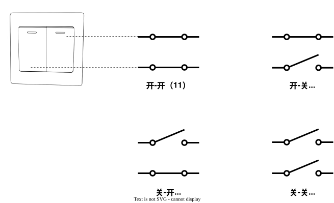

## 2. 变量

### 2.1 简介

　　计算机本质是一种数据处理工具，它通过算术运算、逻辑判断、状态转换等操作对数据进行处理，最终产生新的数据。变量则是程序中用于存储数据的容器，既可以保存待处理的原始数据，也可以保存数据处理过程中产生的中间结果和最终结果。在 Rust 中，定义变量的基本语法格式为：

```rust
let 变量名: 数据类型 = 变量值;
```

+ let：关键字，用于声明变量，告诉编译器变量从这里开始。
+ 变量名：容器的名字，用于描述数据的用途和访问其中存储的数。
+ 数据类型：容器可以存放的数据类型，并决定容器大小。
+ 变量值：容器存放的数据。

```rust
fn main() {

    // 定义一个变量，存储数学成绩，值为 90
    let math_score = 90;

    // 定义一个变量并指定数据类型为 u8，存储 Rust 成绩
    let rust_score: u8 = 100;

    // 定义一个变量，存储计算结果
    let sum_score = math_score + rust_score;

    // 打印总分
    println!("总分: {}", sum_score);
}
```

```shell
shell> cargo run
总分: 190
```

　　Rust 中，大多数情况下可以省略数据类型标注，编译器会根据变量的初始值和上下文自动推断其类型。不过，当类型推断存在歧义，或者为了提升代码的可读性和可维护性时，可以通过显式类型标注来明确指定变量的类型。

　　变量名由开发者自定义，但必须遵循 Rust 的命名规则：变量名只能由英文字母（区分大小写）、数字（0–9）以及下划线（`_`）组成，并且不能以数字开头。Rust 官方推荐使用小写字母命名变量，当变量名由多个单词组成时，通常使用下划线分隔单词，即采用 **snake_case** 命名风格。


### 2.2 变量值的本质

　　计算机是一种电子设备，其一切都是电路，程序中的数据最终都需要通过这些电路进行表示和存储。在电路中，电流、电压、电感、电阻等物理量都具有大小，理论上可以利用这些物理量来表示数值。例如，可以使用 5 伏特（V）的电压表示数字 5。然而，由于实现复杂、稳定性和成本等方面的限制，现代计算机并未采用这些方式来表示和存储数据，而是使用电路的状态表示数据，只需要一个简单的开关即可实现，开关导通时表示数值 1，开关断开时表示数值 0。

　　单个开关只有“导通”和“断开”两种状态，因此只能表示两个数值：0 和 1。如果需要表示更大的数值，只需要增加更多的开关即可。例如，两个开关可以形成四种不同的状态组合：开开（11）、开关（10）、关开（01）和关关（00）。每种状态组合都对应一个唯一的数值，因此可以表示 0～3 共 4 个不同的数值。以此类推，使用 *n* 个开关时，可以产生 $2^n$​ 种不同的状态组合，能够表示的数据范围也会随之扩大。在计算机中，每个开关的状态可以表示一个数据位，单位称为 **Bit（比特，简称位）**。

　　因此，在计算机中，**数据（变量值）本质一组开关状态的组合，不同的数据对应不同的开关状态组合。**




### 2.3 数据类型的本质

　　数据类型决定了变量能够存储的数据种类，例如整数、小数、文本等，同时也决定了用于存储数据的容器大小（即开关的数量），而容器大小进一步决定了数据的取值范围。Rust 中的数值类型提供了 8 位、16 位、32 位、64 位和 128 位不同大小的类型，用于表示不同范围和精度的数值。通过`size_of::<数据类型>()` 函数查看指定数据类型大小，返回结果以字节（Byte）为单位，1 Byte 等于 8 Bit。

```rust
fn main() {
    // 查看 u8 数据类型大小
    let size_of_u8  = size_of::<u8>();
    println!("u8 类型大小: {}", size_of_u8);

    // 查看 u16 数据类型大小
    let size_of_u16 = size_of::<u16>();
    println!("u16 类型大小: {}", size_of_u16);

    // 查看 u8 类型数值范围（仅支持数值类型）
    let min = u8::MIN;
    let max = u8::MAX;
    println!("u8 类型范围：{}-{}", min, max);

    // 编译报错：
    // u8 类型的取值范围是 0 ～ 255，无法存放超过该范围的数值
    // let num: u8 = 256;
}
```

```shell
shell> cargo run
u8 类型大小: 1
u16 类型大小: 2
u8 类型范围：0-255
```

　　在计算机系统中，常见的数据存储单位包括 **Bit（位）**、**Byte（字节）**、**KB（千字节）**、**MB（兆字节）**、**GB（吉字节）和  TB（太字节） 等。各存储单位之间的换算关系如下：

- 1 Byte（字节）等于 8 Bit（位）
- 1024 Byte（字节）等于 1 KB（千字节）
- 1024 KB（千字节）等于 1 MB（兆字节）
- 1024 MB（兆字节）等于 1 GB（吉字节）
- 1024 GB（吉字节）等于 1 TB（太字节）

　　数据类型除了决定容器大小（即开关的数量）之外，还决定这些开关的解析方式，不同的数据类型可能采用不同的解析规则。例如，当使用 8 位开关且全部用于表示数据时，可以表示 0～255 共 256 个不同的数值，如果还需要支持负数，则需要采用不同的解析规则，以便在有限的开关状态中同时表示数值大小和正负信息。对于支持负数的整数类型，现代编程语言通常会将最高位作为符号位，用于表示数值的正负：当该位为 1 时表示负数，为 0 时表示正数；其余 7 位用于表示数值大小。因此，8 位整数可以表示的数值范围为 −128～127。

　　**小结：数据类型决定了变量能够存放的数据种类、容器的大小、数据的取值范围，以及对应的解析规则。**


### 2.4 变量名的本质
　　计算机中用于存储数据的核心硬件主要有两类：内存和磁盘（如硬盘、U 盘）。其中，内存主要用于临时存放正在运行的数据（变量）和程序（代码），相比磁盘，其容量通常较小、成本较高，但访问速度更快，不过断电后其中的数据会丢失。磁盘则主要用于长期保存数据，具有容量大、成本低的特点，但访问速度较慢，且断电后数据通常不会丢失。由于磁盘的访问速度远低于内存，磁盘中的数据通常需要先加载到内存，再由 CPU 进行处理。

　　内存由一系列存储单元组成，每个存储单元以字节（Byte）为基本单位。程序中的变量值存放在内存的一个或多个连续的存储单元中，所占空间大小由变量的数据类型决定。为了便于访问和管理，每个存储单元都被赋予一个唯一的编号，通常从 0 开始连续递增，这个编号称为**内存地址**。变量名本质上就是内存地址的别名，它描述了该地址中数据的含义，使程序员能够更直观地在代码中理解和使用这些数据。

　　在 Rust 中，可以使用取地址运算符 `&` 获取变量名对应的内存地址，使用解引用运算符 `*` 访问该内存地址中存储的数据。

```rust
fn main() {
    // 定义一个变量
    let number: u32 = 10;

    // 获取内存地址
    let number_ptr = &number;
    println!("内存地址: {:p}", number_ptr);

    // 获取内存地址中存放的数据
    println!("该地址存放的数据：{}", *number_ptr);
}
```

```shell
shell> cargo run
内存地址: 0x7ffe8ea1d62f
该地址存放的数据：10
```


### 2.5 变量的可变性

　　在 Rust 中，变量的值默认不可修改；若需修改，必须在定义时使用 `mut` 关键字显式声明该变量可变。

```rust
fn main() {
    let num1 = 100;
    // num = 200;        // 编译失败，变量值默认不允许修改
    println!("变量默认不允许修改：num1={num1}");

    let mut num2= 200;
    println!("修改前：num2={num2}");

    num2 = 300;          // 编译成功，增加 mut 关键字后，变量可以修改
    println!("修改后：num2={num2}");
}
```

```shell
shell> cargo run
变量默认不允许修改：num1=100
修改前：num2=200
修改后：num2=300
```


### 2.6 常量

　　Rust 语言除了支持变量外，还支持常量。常量使用 `const` 关键字定义，通常采用全大写字母命名，并且必须显式指定数据类型。对于较小的常量类型，编译器通常会在编译阶段直接将常量值进行内联替换，避免程序运行时的额外存储和访问开销。

```rust
fn main() {
    // 定义一个常量，必须明确指定数据类型
    const NUMBER: u8 = 10;

    // 编译时, 会替换为常量的实际值，下面的代码等同于 let sum = 100 + 10;
    let sum = 100 + NUMBER;
    println!("sum is {}", sum);
}
```


### 2.7 变量作用域

　　每个变量都有自己的作用域，变量只能在其所属作用域内使用和访问，当变量离开作用域时，Rust 会自动释放其占用的资源（例如内存空间）。此外，不同作用域中的同名变量彼此独立，互不影响，内层作用域中的变量可以覆盖外层作用域中的同名变量，但不会改变外层变量的值。

　　根据作用域范围的不同，变量通常可以分为局部变量和全局变量。局部变量定义在函数或代码块内部，只能在对应的局部作用域内访问。全局变量定义在函数之外，在程序运行期间始终存在，可以在程序的多个位置访问，常用于存放需要在整个程序中共享的数据。

```rust
fn main() {
    let x = 10; // 局部变量 x，作用域从这里开始

    {
        let y = 20; // 局部变量 y，只在这个代码块内有效
        println!("x = {}, y = {}", x, y);
    } // y 在这里离开作用域并被自动释放

    // 编译错误：y 已超出作用域，无法使用和访问
    // println!("{}", y); 

    println!("x = {}", x);
} // x 在这里离开作用域并被自动释放
```

```shell
shell> cargo run
x = 10, y = 20
x = 10
```

　　在 Rust 中，全局变量通过 `static` 关键字定义，并且必须显式指定数据类型。

```rust
// 定义一个全局变量 GLOBAL_COUNT，使用 static 关键字声明
// 该变量具有全局作用域，在程序运行期间始终存在
static GLOBAL_COUNT: i32 = 100;

// 引用全局变量
static GLOBAL_REF: i32 = GLOBAL_COUNT;

fn main() {
    // 在 main 函数中访问全局变量 GLOBAL_COUNT
    println!("GLOBAL_COUNT = {}", GLOBAL_COUNT);

    // 在 main 函数中访问全局变量 GLOBAL_REF
    println!("GLOBAL_REF = {}", GLOBAL_REF);
}
```

```shell
shell> cargo run
GLOBAL_COUNT = 100
GLOBAL_REF = 100
```


### 2.8 变量遮蔽

　　变量遮蔽（Variable Shadowing）是指在同一作用域内，后声明的变量会覆盖先前声明的同名变量，使原变量暂时无法被访问，二者的数据类型可以不同。变量遮蔽常用于数据类型转换等场景，可以减少程序员在变量命名上的负担，但变量遮蔽也存在一定争议，过度使用可能会降低代码的可读性，建议仅在类型转换时使用。

```rust
fn main() {
    // 定义一个 u8 类型的变量 num
    let num: u8 = 10;
    println!("遮蔽前：num={}", num);

    // 在同一作用域中遮蔽 num，数据类型可以不同
    let num: i32 = 200;
    // 此处访问的是后声明的 num（i32 类型）
    println!("遮蔽后：num={}", num);
}
```

```shell
shell> cargo run
遮蔽前：num=10
遮蔽后：num=200
```

　　需要注意的是，变量遮蔽只在当前作用域内生效，当离开变量遮蔽所在的作用域后，原先被遮蔽的变量会重新变得可见。因此，被遮蔽的变量并未被销毁，而只是暂时无法访问。

```rust
fn main() {
    // 定义一个 u8 类型的变量 num
    let num: u8 = 10;
    println!("outer num (u8): {}", num);

    {
        // 在内层作用域中遮蔽 num，并将类型改为 i8
        let num: i8 = -10;
        println!("inner num (i8): {}", num);
    } // 内层作用域结束，被遮蔽的 num 失效

    // 外层作用域中的 num 重新可见
    println!("outer num (u8): {}", num);
}
```

```shell
shell> cargo run
outer num (u8): 10
inner num (i8): -10
outer num (u8): 10
```


### 2.9 二进制

　　在日常生活中，人们最常使用十进制表示数据，即以 10 为基数的计数方式。十进制由 0～9 十个数字符号组成，每一位可以表示十种不同的状态，当某一位达到最大值 9 后继续增加时，该位归零，并向更高位进 1。而在计算机中，由于电子元件通常只能稳定表示两种状态——通电（1）和断电（0），因此计算机采用二进制表示数据。二进制以 2 为基数，每一位只能表示两种状态，即 0 和 1，当某一位达到最大值 1 后继续增加时，该位归零，并向更高位进 1。

　　在日常生活中，也可以发现类似二进制的计数方式，例如，周六加周日等于一个周末（即 1 + 1 = 10），进位后单位变为"周末"，这就是一个二进制运算。若再将两个周末相加，满 2 后继续向更高位进位，如此反复，便形成了二进制的计数单位 1、2、4、8、16……，类似于十进制中的 个、十、百、千、万……。

```shell
二进制     百万      十万       万        千        百        十         个 
<──────────┼────────┼─────────┼─────────┼─────────┼─────────┼─────────┤
十进制     64       32        16         8         4         2         1
```

　　二进制运算与十进制运算在规则上完全一致，只是进位的基数从 10 变成了 2，二进制加法的基本规则如下：

- `0 + 0 = 0`
- `0 + 1 = 1`
- `1 + 0 = 1`
- `1 + 1 = 10`（向高位进 1）

```shell
示例：
  101 (5)          110 (6)          1001 (9)
+ 011 (3)        + 010 (2)        - 0011 (3)
-----            -----            ------
 1000 (8)         1000 (8)          0110 (6)
```

　　Rust 支持使用二进制、十进制、八进制和十六进制来表示数据，八进制满 8 进 1（数位范围为 0～7），十六进制满 16 进 1（数位范围为 0～9 和 A～F），其进位规则与十进制、二进制一致。在 Rust 中，整数默认采用十进制表示，其他进制需要在数值前添加对应的前缀：二进制以 `0b` 开头，八进制以 `0o` 开头，十六进制以 `0x` 开头。需要注意的是，无论代码中使用哪种进制表示数据，计算机在底层存储和处理数据时始终采用二进制形式。不同进制只是对同一个数值的不同表示方式，主要用于提高代码的可读性，以及在不同场景下更直观地表达数据。

```rust
fn main() {
    // 同一个数值 16，用不同进制表示
    let decimal = 16;        // 十进制（默认）
    let _binary = 0b10000;    // 二进制
    let _octal = 0o20;        // 八进制
    let _hexadecimal = 0x10;  // 十六进制

    // 将十进制 16 以不同进制格式输出，虽然表示形式不同，但数值本身完全相同
    println!("十进制: {}", decimal);
    println!("二进制: {:b}", decimal);
    println!("八进制: {:o}", decimal);
    println!("十六进制: {:x}", decimal);
}
```

```shell
shell> cargo run
十进制: 16
二进制: 10000
八进制: 20
十六进制: 10
```

　　十六进制则是为了更加直观、便捷地表示和阅读二进制数据而产生的。如果直接阅读二进制数据，需要面对大量连续的 **0** 和 **1**，不仅表示形式冗长，也容易出现阅读错误。而十六进制每一位恰好对应 4 个二进制位，可以将较长的二进制数据转换为更简洁、更易读的形式。

```text
┌──────────────────────────────────────────────────────────────────────────────────┐
│                   十六进制（Hex）与二进制（Binary）对应关系表                         │
├──────────┬────────┬────────┬────────┬────────┬────────┬────────┬────────┬────────┤
│   Hex    │   0    │   1    │   2    │   3    │   4    │   5    │   6    │   7    │
├──────────┼────────┼────────┼────────┼────────┼────────┼────────┼────────┼────────┤
│  Binary  │  0000  │  0001  │  0010  │  0011  │  0100  │  0101  │  0110  │  0111  │
├──────────┼────────┼────────┼────────┼────────┼────────┼────────┼────────┼────────┤
│   Hex    │   8    │   9    │   A    │   B    │   C    │   D    │   E    │   F    │
├──────────┼────────┼────────┼────────┼────────┼────────┼────────┼────────┼────────┤
│  Binary  │  1000  │  1001  │  1010  │  1011  │  1100  │  1101  │  1110  │  1111  │
└──────────┴────────┴────────┴────────┴────────┴────────┴────────┴────────┴────────┘
```

```rust
fn main() {
    // Rust 支持使用下划线分割长数值，以便阅读
    let binary = 0b_1101_0101_1010_1100;

    // 十六进制可以将二进制压缩为四位，且更有辨识度
    let hexadecimal = 0xD5AC;

    // 都以十六进制格式输出，输出的值相同
    println!("0x{:X}, 0x{:X}", binary, hexadecimal);
}
```

```shell
shell> cargo run
0xD5AC, 0xD5AC
```


### 2.10 位运算符

　　Rust 提供了一系列位运算符，直接对数据的每一个二进制位进行操作，包括按位与（AND）、按位或（OR）、按位非（NOT）、按位异或（XOR），以及左移和右移运算符。位运算符常用于性能优化、嵌入式系统、操作系统内核、标志位（flags）管理以及底层协议处理等场景。

| 运算符 | 描述                                      |
| --- | --------------------------------------- |
| &   | 按位与：只有对应的两个二进制位都为 1 时，结果位才为 1。          |
| \|  | 按位异或：对应的两个二进制位相同则为 0，不同则为 1。            |
| ^   | 按位异或：对应的两个二进制位相同则为 0，不同则为 1。            |
| !   | 按位取反：将每一位的 0 变为 1，1 变为 0。               |
| <<  | 左移：将所有二进制位向左移动若干位，高位被丢弃，低位补 0。          |
| >>  | 右移：将所有二进制位向右移动若干位；无符号数高位补 0，有符号数高位补符号位。 |

　　例如，

```rust
fn main() {
    /*
    与运算，按位与，两个值都为 1 时，结果才为 1。
       0001
     & 0010
    ───────
       0000
    */
    let and = 1 & 2;
    println!("1 & 2 = {}", and);

    /*
    或运算，按位或，两个值都为 0 时，结果才为 0。
       0001
     | 0010
    ───────
       0011
    */
    let or = 1 | 2;
    println!("1 | 2 = {}", or);

    /*
    异或运算，按位异或，两个位相同为0，相异为 1。
       0001
     ^ 0010
    ───────
       0011
    */
    let xor = 1 ^ 2;
    println!("1 ^ 2 = {}", xor);

    /*
    取反运算，按位取反，0 变 1，1 变 0。
     ! 0001
    ───────
       1110
    */
    let not = !1;
    println!("!1 = {}", not);

    /*
    左移运算，将各二进位全部左移若干位，高位丢弃，低位补 0
        0000 0001
     <<         1
    ─────────────
        0000 0010
    */
    let left_shift = 1 << 1;
    println!("1 << 2 = {}", left_shift);

    /*
    右移运算，将各二进位全部右移若干位，无符号数高位补 0
        0000 0100
     >>         1
   ──────────────
        0000 0010
    */
    let unsigned_right_shift: u8 = 4 >> 1;
    println!("4 >> 2 = {}", unsigned_right_shift);

    /*
    右移运算，将各二进位全部右移若干位，有符号数高位补 1
        1000 0000
     >>         1
   ──────────────
        1100 0000
    */
    let signed_right_shift: i8 = -128 >> 1;
    println!("126 >> 2 = {}", signed_right_shift);
}
```


**参考链接**

https://www.ruanyifeng.com/blog/2007/10/ascii_unicode_and_utf-8.html

https://rustmagazine.github.io/rust_magazine_2021/chapter_12/simple-rust-in-assembly.html
