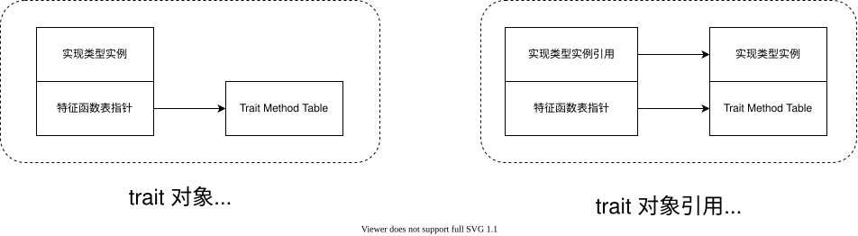

## 6. 特征

### 6.1 简介

　　特征（Trait）可以将多个函数组合成一种新的类型，用于为不同的数据类型定义统一的函数接口，使不同类型能够以一致的方式调用相关功能，提升代码的灵活性和复用性。例如，在交通系统中可定义 `Travel` trait，并在其中声明 `travel_time()` 函数接口用于计算行程时间，汽车、火车、飞机等交通工具只需实现该 trait，即可通过统一的 `travel_time()` 函数计算各自行程时间。


### 6.2 基本使用

　　在 Rust 中，声明 trait 的语法形式为 `trait TraitName { 函数声明 }`，为具体类型实现 trait 的语法为 `impl TraitName for TypeName { 函数实现 }`。


```rust
// 定义交通工具接口（trait）
trait Travel {
    // 定义计算行程时间的函数
    fn travel_time(&self, distance: f64) -> f64;
}

// 定义汽车类型，并实现 Travel trait
struct Car;

impl Travel for Car {
    fn travel_time(&self, distance: f64) -> f64 {
        let speed = 80.0; // 汽车平均速度（km/h）
        distance / speed
    }
}

// 定义飞机类型，并实现 Travel trait
struct Plane;

impl Travel for Plane {
    fn travel_time(&self, distance: f64) -> f64 {
        let speed = 800.0; // 飞机平均速度（km/h）
        distance / speed
    }
}

fn main() {
    // 不同的交通工具切换实例类型即可，后面的计算行程代码无需任何修改，
    // 因为都实现了 Travel trait 中定义的函数
    let _travel = Car;
    let travel = Plane;

    // 计算行程时间
    let distance = 300.0;
    let travel_time = travel.travel_time(distance);
    println!("该交通工具行程 {distance} km 需要 {:.2} 小时", travel_time);
}
```

```shell
shell> cargo run
该交通工具行程 300 km 需要 0.38 小时
```


### 6.3 静态派发（impl trait）

　　`impl Trait` 可作为函数参数或返回值，表示接收任意实现该 trait 的类型。编译器会在编译期将 `impl Trait` 单态化替换为具体类型，并针对每种具体类型生成对应的函数实现，调用时直接调用对应实现。这种在编译阶段确定具体类型，并通过直接调用对应实现的方式称为静态派发。


```rust
// 定义交通工具接口
trait Travel {
    fn travel_time(&self, distance: f64) -> f64;
}

struct Car;

impl Travel for Car {
    fn travel_time(&self, distance: f64) -> f64 {
        let speed = 80.0; // 汽车平均速度（km/h）
        distance / speed
    }
}

struct Plane;

impl Travel for Plane {
    fn travel_time(&self, distance: f64) -> f64 {
        let speed = 800.0; // 飞机平均速度（km/h）
        distance / speed
    }
}

// 统一计算行程时间的函数，impl Travel 表示任意实现 Travel 的类型都可以
fn calc_time(vehicle: impl Travel, distance: f64) -> f64 {
    if distance <= 0.0 {
        println!("距离必须大于 0");
        return -1.0;
    }

    return vehicle.travel_time(distance);
}

fn main() {
    // 创建不同的交通工具实例
    let car = Car;
    let plane = Plane;

    let distance = 300.0;
    // 使用不同交通工具计算行程时间，传递不同的实例即可，calc_time 函数不用任何修改
    println!("车行程 {distance} km 需要 {:.2} 小时", calc_time(car, distance));
    println!("飞机行程 {distance} km 需要 {:.2} 小时", calc_time(plane, distance));
}
```

　　静态派发的优点是无需运行时查找具体实现，因此不会产生额外的运行时开销；缺点是编译器会为每种具体类型生成对应的函数实现，导致代码膨胀，增加最终生成程序的体积。例如，上述示例中的 `calc_time()` 函数在编译后会生成两个针对不同类型的函数实现。


```rust
// 针对 Car 类型生成的函数
fn calc_time_car(vehicle: Car, distance: f64) {
   ... 
}

// 针对 Plane 类型生成的函数
fn calc_time_plane(vehicle: Plane, distance: f64) {
    ...
}
```

```shell
# 通过符号表，可以看到生成了两个 calc_time 函数
shell> cargo nm | grep calc
0000000000016290 t hello::calc_time::hb11eb696a5077967
0000000000016330 t hello::calc_time::hddb6f41edc680d5a
```

　　另外，静态派发依赖编译期确定具体类型，因此要求编译器在编译阶段能够明确类型信息。对于只有在运行时才能确定具体类型的情况，无法使用静态派发。例如，在下述示例中，`choose_travel()` 函数的返回类型取决于函数参数的实际值，而参数值在编译阶段无法确定。


```rust
struct Car;
struct Plane;

trait Travel {
    // 根据距离计算所需时间（单位：小时）
    fn travel_time(&self, distance: f64) -> f64;
}

impl Travel for Car {
    fn travel_time(&self, distance: f64) -> f64 {
        let speed = 80.0; // 汽车平均速度（km/h）
        distance / speed
    }
}

impl Travel for Plane {
    fn travel_time(&self, distance: f64) -> f64 {
        let speed = 800.0; // 飞机平均速度（km/h）
        distance / speed
    }
}

// 返回值派发依赖于函数参数的值，函数参数的值在编译期无法确定
fn choose_travel(index: u8) -> impl Travel {
    if index == 0 {
        return Car;
    }

    // 编译报错
    return Plane;
}

fn main() {
}
```

```shell
shell> cargo run
   Compiling hello v0.1.0 (/file/rust/project/hello)
error[E0308]: mismatched types
  --> src/main.rs:30:12
   |
24 | fn choose_travel(index: u8) -> impl Travel {
   |                                ----------- expected `Car` because of return type
...
30 |     return Plane;
   |            ^^^^^ expected `Car`, found `Plane`

For more information about this error, try `rustc --explain E0308`.
error: could not compile `hello` (bin "hello") due to 1 previous error
```


### 6.4 动态派发（dyn trait）

　　动态派发（Dynamic Dispatch）与静态派发不同：调用目标并非在编译期确定，而是在运行期根据对象的具体类型查找并调用对应实现。这一机制既解决了编译期无法确定类型的问题，也避免了静态派发因单态化替换导致的代码膨胀，但由于需要在运行时查找实际实现，相比编译期即可确定目标的静态派发，动态派发会产生一定的运行时性能开销。


```rust
// 定义交通工具接口
trait Travel {
    fn travel_time(&self, distance: f64) -> f64;
}

struct Car;

impl Travel for Car {
    fn travel_time(&self, distance: f64) -> f64 {
        let speed = 80.0; // 汽车平均速度（km/h）
        distance / speed
    }
}

struct Plane;

impl Travel for Plane {
    fn travel_time(&self, distance: f64) -> f64 {
        let speed = 800.0; // 飞机平均速度（km/h）
        distance / speed
    }
}

// 动态派发
fn calc_time(vehicle: &dyn Travel, distance: f64) -> f64 {
    if distance <= 0.0 {
        println!("距离必须大于 0");
        return -1.0;
    }

    return vehicle.travel_time(distance);
}

fn main() {
    // 创建不同的交通工具实例
    let car = Car;
    let plane = Plane;

    let distance = 300.0;
    // 使用不同交通工具计算行程时间，传递不同的实例即可，calc_time 函数不用任何修改
    println!("车行程 {distance} km 需要 {:.2} 小时", calc_time(&car, distance));
    println!("飞机行程 {distance} km 需要 {:.2} 小时", calc_time(&plane, distance));
}
```

```shell
shell> cargo run
车行程 300 km 需要 3.75 小时
飞机行程 300 km 需要 0.38 小时

# 查看符号表，可以看到只生成一个函数，没有为每个调用类型都生成一个函数
shell> cargo nm | grep calc_time
0000000000016270 t hello::calc_time::h9a45e0d4651c731a
```

　　动态派发通过 trait 对象实现（`dyn Trait`）。该对象由具体实现类型的实例和函数表指针（Trait Method Table）组成，程序在运行时通过查找该函数表来调用对应的函数实现。由于具体类型实例的大小在编译期无法确定，trait 对象属于动态大小类型（Dynamically Sized Type, DST），但 Rust 要求在编译期确定每个值的大小，以便合理分配和管理内存，因此 trait 对象只能通过大小固定的引用或指针（如 `&dyn Trait` 或 `Box<dyn Trait>`）间接访问。trait 对象和 trait 对象引用的区别如下图：




```rust
use std::mem::transmute;

struct Car(i32);

#[allow(dead_code)]
struct Plane(i64);

trait Travel {
    #[allow(dead_code)]
    fn travel_time(&self, distance: f64) -> f64;
}

impl Travel for Car {
    fn travel_time(&self, distance: f64) -> f64 {
        let speed = 80.0; // 汽车平均速度（km/h）
        distance / speed
    }
}

impl Travel for Plane {
    fn travel_time(&self, distance: f64) -> f64 {
        let speed = 800.0; // 飞机平均速度（km/h）
        distance / speed
    }
}

fn main() {

    let car = Car(1);

    // 动态大小类型，编译器无法获取大小
    // let size = size_of::<dyn Vehicle>();
    // println!("size: {}", size);

    // 通过引用访问 trait 对象
    let trait_obj = &car as &dyn Travel;

    // 将 Trait 对象引用拆解为数据指针和虚函数表指针
    let raw_ptr: [usize; 2] = unsafe { transmute(trait_obj) };
    let data_ptr = raw_ptr[0];
    let vtable_ptr = raw_ptr[1];

    unsafe {
        // 验证数据部分
        let car_ptr: *const Car = data_ptr as *const Car;
        println!("data_ptr 指向的值: {}", (*car_ptr).0);

        // 验证函数表指针，指向一个 usize 数组，函数表之中的内容如下:
        // 0: drop_glue
        // 1: size
        // 2: align
        // 3: trait 第一个方法
        let vtable_base = vtable_ptr as *const usize;

        let size = *vtable_base.add(1);
        let align = *vtable_base.add(2);
        println!("VTable 记录的对象大小: {} 字节, 对齐: {}", size, align);

        // 调用 travel_time 方法
        type TravelTimeFn = unsafe fn(data: *const (), distance: f64) -> f64;
        let travel_time_fn: TravelTimeFn = transmute(*vtable_base.add(3));
        let result = travel_time_fn(data_ptr as *const (), 300.0);

        println!("手动调用 VTable 方法得到的时间: {} 小时", result);
    }
}
```

```shell
shell> cargo run
data_ptr 指向的值: 1
VTable 记录的对象大小: 4 字节, 对齐: 4
手动调用 VTable 方法得到的时间: 3.75 小时
```


### 6.5 Trait 继承

　　Trait 继承用于声明 trait 之间的依赖关系，通过继承可以要求实现某个 trait 的类型必须同时实现其父 trait。这样，子 trait 中的方法可以直接使用父 trait 提供的功能。例如，下述示例中，子 trait 继承自父 trait，并依赖父 trait 提供的 `get_width()` 和 `get_height()` 函数计算面积。


```rust
// 父 Trait, 定义获取宽度和高度的函数
trait Dimensions {
    fn get_width(&self) -> f64;
    fn get_height(&self) -> f64;
}

// 子 Trait，赖父 trait 提供的宽度和高度函数计算面积
trait Area: Dimensions {
    fn area(&self) -> f64;
}

// 定义一个表示矩形的结构体
struct Rectangle {
    width: f64,
    height: f64,
}

impl Dimensions for Rectangle {
    fn get_width(&self) -> f64 {
        self.width
    }

    fn get_height(&self) -> f64 {
        self.height
    }
}

// 必须实现父 trait Dimensions 才能实现子 trait Area
impl Area for Rectangle {
    fn area(&self) -> f64 {
        // 依赖父 trait 提供的宽度和高度计算面积
        self.get_width() * self.get_height()
    }
}

fn main() {
    let rect = Rectangle { width: 5.0, height: 10.0 };
    // 计算矩形的面积
    println!("面积: {}", rect.area());
}
```

```shell
shell> cargo run
面积: 50
```
