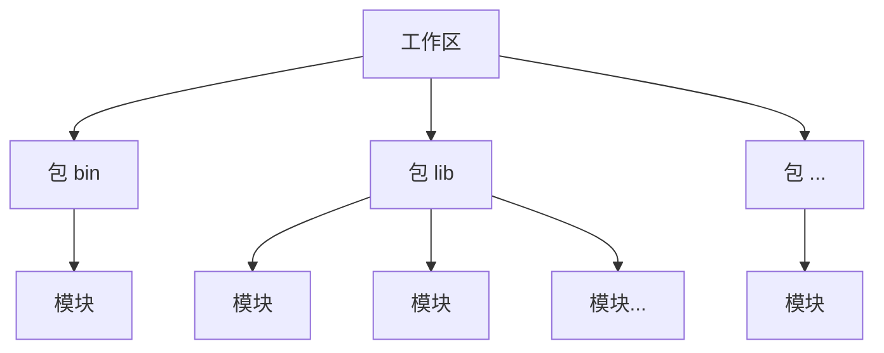

## 8. 工程化

### 8.1 简介
　　对于功能复杂或持续迭代的大型项目，代码量可能达到数万、数十万，甚至数百万、数千万行。如何高效组织与管理如此海量的代码，并保证系统具备良好的可维护性和可扩展性，是软件开发过程中必须解决的问题。人类大脑擅长通过**分类和分层**的方式处理复杂信息，将庞大的问题拆分为多个更容易理解和管理的部分。编程语言也采用了类似的思想，通过模块、命名空间、包、类等机制组织代码。目前，主流编程语言（如 Rust、C/C++、Java、Go、Python 等）都提供了相应的代码组织机制，以便开发者构建和维护大型软件系统。

　　Rust 同样基于分类和分层思想设计项目结构，通过工作区（Workspace）、包（Package）、模块（Module）等机制，将代码划分为多个职责明确、层次清晰的组织单元（见下图），提高代码的可读性、可维护性和可扩展性。在实际开发过程中，开发者可以根据项目规模和复杂程度灵活选择所需的组织层级。小型项目可能只需要使用模块管理代码，而大型项目则可以进一步结合包和工作区，将多个功能模块拆分为独立的组件进行管理。




### 8.2 包（Crate）
　　在 Rust 中，包（crate）是程序编译和分发的基本单元，分为**可执行程序包**和**库包**。可执行程序包用于生成可执行程序，库包（crate）则用于提供功能模块，供其他项目引用和复用。每个包（crate）都包含一个 `Cargo.toml` 配置文件，用于管理包的元数据（如名称、版本等）以及其依赖项。

#### 8.2.1 可执行程序包

　　可执行程序包必须包含 `src/main.rs` 文件，并在其中定义程序的入口点 `main` 函数。使用 `cargo new 名称` 命令可以快速创建一个可执行程序包，生成的项目会包含一个 `Cargo.toml` 配置文件和一个 `src/main.rs` 文件，其中包含默认的 `main` 函数实现。

```shell
# 创建可执行程序包，名称为 app
shell> cargo new app

# 编译运行程序
shell> cd app
shell> cargo run
Hello, world!

# 查看项目结构
shell> tree app/
app/
├── Cargo.toml           # 生成的配置文件
└── src
    └── main.rs          # 生成 main.rs 文件

# 查看生成的配置文件
shell> cat app/Cargo.toml
[package]
name = "app"             # 名称
version = "0.1.0"        # 版本号
edition = "2024"

[dependencies]           # 依赖项

# 查看默认生成的 main 函数
shell> cat app/src/main.rs
fn main() {
    println!("Hello, world!");
}
```


#### 8.2.2 库包

　　库包必须包含 `src/lib.rs` 文件，并在其中定义库的公共功能和接口。使用 `cargo new --lib 名称` 命令可以快速创建一个库包，生成的项目会包含一个 `Cargo.toml` 配置文件和一个 `src/lib.rs` 文件，默认会生成一个 `add` 示例函数。下面的示例演示了如何创建一个可执行程序包 `app` 和一个库包 `libmath`，并在 `app` 中引用 `libmath`。

```shell
# 创建一个可执行程序包 app 和一个库包 libmath
shell> cargo new app
shell> cargo new --lib app/libmath   # 名称前面可以加路径

# 查看库包的项目结构
shell> tree app/libmath
liblog/
├── Cargo.toml
└── src
    └── lib.rs                   # lib.rs 默认会生成一个 add 函数
```

```rust
# 在 app 中引用 libmath
shell> cat app/Cargo.toml
[package]
name = "app"
version = "0.1.0"
edition = "2024"

[dependencies]
libmath = { path = "./libmath" }  # 添加依赖

# 在 app 中使用库包
shell> cat app/src/main.rs
fn main() {
    let sum = libmath::add(1, 5);
    println!("sum = {sum}");
}
```

```shell
# 编译运行
shell> cargo run
sum = 6
```


#### 8.2.3 使用第三方包

　　除了本地库包，还可以使用第三方包，Rust 社区提供了一个名为 [crates.io](https://crates.io) 的平台，用户可以在其中发布和共享包。当我们需要某个库时，可以到 [crates.io](https://crates.io) 上搜索相关包，然后使用 `cargo add xxx` 命令添加，或者手动在 `Cargo.toml` 文件的 `[dependencies]` 部分添加，指定第三方包的名称和版本，Rust 会自动从 crates.io 上下载并构建这些依赖包。下述示例演示了如何添加并使用随机数生成库 `rand`。

```shell
shell> cargo new app
shell> cd app

# 添加第三方包
shell> cargo add fastrand          # 默认最新版本
shell> cargo add fastrand@2.5.0    # 指定版本，推荐使用，可以避免依赖库升级导致程序异常

# 查看添加的依赖包
shell> cat Cargo.toml
[package]
name = "app"
version = "0.1.0"
edition = "2024"

[dependencies]
fastrand = "2.5.0"

# 编译时会自动下载并构建依赖包
shell> cargo build
......
```

        依赖添加完成后，即可使用其提供的功能。Rust 社区中有大量成熟的第三方库，涵盖网络通信、数据处理、数据库、异步编程、Web 开发等常见应用场景，可以直接复用这些现成的功能，快速扩展项目能力。

```rust
fn main() {
    // 生成 [0, 100) 范围内的随机整数
    let range_int = fastrand::u32(0..100);
    println!("0~99 的随机整数: {}", range_int);

    // 生成 [0, u8::MAX] 范围内的随机整数
    let range_u8 = fastrand::u8(..=u8::MAX);
    println!("随机 u8: {}", range_u8);
}intln!("随机 u8: {}", range_u8);
}
```

```shell
# 编译运行
shell> cargo run
0~99 的随机整数: 89
随机 u8: 51
```

　　为了避免每次使用时都书写完整的模块路径，Rust 提供了 `use` 关键字，可以将指定的模块、类型或函数引入当前作用域；如果需要修改引入项的名称或避免名称冲突，还可以使用 `as` 关键字为其设置别名。

```rust
use fastrand::u32;
use fastrand::u8 as random_u8;

fn main() {
    // 生成 [0, 100) 范围内的随机整数
    let range_int = u32(0..100);
    println!("0~99 的随机整数: {}", range_int);

    // 使用 as 为 u8 函数设置别名
    let range_u8 = random_u8(..);
    println!("随机 u8: {}", range_u8);
}
```

```shell
# 编译运行
shell> cargo run
0~99 的随机整数: 97
随机 u8: 116
```


### 8.3 工作区（Workspace）

　　工作区（Workspace）处于项目组织的最高层级，用于将多个 Crate 聚合到一个目录下，通过顶层 `Cargo.toml` 文件进行集中管理。各成员 Crate 在保持独立性的同时，可以共享配置（如版本、编译目标等），并统一依赖版本与编译输出目录。下述示例演示了如何创建工作区，以及如何通过顶层 `Cargo.toml` 管理 `app`、`liblog` 与 `libutil` 等多个成员包，实现代码的模块化解耦与资源共享。

```shell
# 创建项目目录
shell> mkdir demo && cd demo

# 创建三个 crate
shell> cargo new app
shell> cargo new --lib liblog
shell> cargo new --lib libutil

# 在根目录创建一个 Cargo.toml 文件作为工作区的配置文件，并将三个 crate 都添加到工作区中
shell> cat Cargo.toml
[workspace]
resolver = "3"
members = [
    "app",
    "liblog",
    "libutil",
]

# 编译运行
shell> cargo run -p app
Hello, world!

# 最终工作区的根目录结构如下
demo/
├── Cargo.toml
├── app
│   ├── Cargo.toml
│   └── src
│       └── main.rs
├── liblog
│   ├── Cargo.toml
│   └── src
│       └── lib.rs
└── libutil
    ├── Cargo.toml
    └── src
        └── lib.rs
```

　　在工作区中，成员 Crate 之间可以相互依赖，但需避免循环依赖——即 A 依赖 B，同时 B 又依赖 A。下面为 `app` 添加对 `libutil` 的依赖，并在代码中使用 `libutil` 提供的功能。

```toml
shell> cat app/Cargo.toml
[package]
name = "app"
version = "0.1.0"
edition = "2024"

[dependencies]
libutil = { path = "../libutil" }
```

```rust
// app/src/main.rs
fn main() {
    // 使用 `libutil` 提供的功能
    let sum = libutil::add(1, 2);
    println!("Sum: {}", sum);
}
```


### 8.4 模块（mod）

　　模块用于在 Crate 内部进一步组织和拆分代码，通过模块，可以将功能相关的代码划分到不同的命名空间中，降低代码之间的耦合，避免命名冲突，并提高项目的可读性、可维护性和可扩展性。Rust 支持在同一源文件、不同源文件以及目录中定义模块，同时支持模块嵌套，从而构建更加层次化、清晰的代码结构。


#### 8.4.1 同一文件中定义

　　在同一个文件中声明模块，可以对相关功能代码进行集中组织，将逻辑相关的内容划分到独立的命名空间中，提高代码的可读性和结构清晰性，适用于较小的模块。例如，下述示例定义了一个交通工具模块，将不同交通工具的行驶时间计算函数统一组织在同一个模块中。

```rust
// 定义一个 vehicles 模块，包含与交通工具相关的代码
mod vehicles {

    // 计算汽车的行驶时间
    pub fn travel_time_by_car(distance: f64) -> f64 {
        let speed = 100.0; // 汽车速度（km/h）
        return distance / speed;
    }

    // 计算飞机的飞行时间
    pub fn travel_time_by_plane(distance: f64) -> f64 {
        let speed = 500.0; // 飞机速度（km/h）
        return distance / speed;
    }
}

fn main() {
    // 计算不同交通工具的行驶时间
    let car_time = vehicles::travel_time_by_car(1000.0);
    let plane_time = vehicles::travel_time_by_plane(1000.0);

    // 输出各交通工具的行驶时间
    println!("汽车行驶时间: {:.2} 小时", car_time);
    println!("飞机飞行时间: {:.2} 小时", plane_time);
}
```

```shell
shell> cargo run
汽车行驶时间: 10.00 小时
飞机飞行时间: 2.00 小时
```

　　此外，Rust 支持模块嵌套，即在一个模块内部定义子模块。通过嵌套结构，可以构建层次化的代码组织方式，使功能划分更清晰，便于代码管理与扩展。例如，下述示例在 `vehicles` 模块内定义了 `transport` 和 `fuel` 两个子模块，分别负责计算行驶时间和油耗，使各模块职责明确，同时保持代码的整洁和可维护性。

```rust
mod vehicles {
    // 计算不同交通工具的行驶时间的模块
    pub mod transport {

        // 计算汽车的行驶时间
        pub fn travel_time_by_car(distance: f64) -> f64 {
            let speed = 100.0; // 汽车速度（km/h）
            return distance / speed;
        }

        // 计算飞机的飞行时间
        pub fn travel_time_by_plane(distance: f64) -> f64 {
            let speed = 500.0; // 飞机速度（km/h）
            return distance / speed;
        }
    }

    // 计算不同交通工具油耗的模块
    pub mod fuel {

        // 计算汽车的油耗（单位：L/100km）
        pub fn consumption_by_car(distance: f64) -> f64 {
            let consumption_rate = 8.0; // 每百公里消耗8升
            return (distance / 100.0) * consumption_rate;
        }

        // 计算飞机的油耗（单位：L/1000km）
        pub fn consumption_by_plane(distance: f64) -> f64 {
            let consumption_rate = 500.0; // 每千公里消耗500升
            return (distance / 1000.0) * consumption_rate;
        }
    }
}

fn main() {
    // 计算不同交通工具的行驶时间
    let car_time = vehicles::transport::travel_time_by_car(1000.0);
    let plane_time = vehicles::transport::travel_time_by_plane(1000.0);

    // 计算不同交通工具的油耗
    let car_fuel = vehicles::fuel::consumption_by_car(1000.0);
    let plane_fuel = vehicles::fuel::consumption_by_plane(1000.0);

    println!("汽车行驶时间: {:.2} 小时, {:.2} 升", car_time, car_fuel);
    println!("飞机飞行时间: {:.2} 小时, {:.2} 升", plane_time, plane_fuel);
}
```

```shell
shell> cargo run
汽车行驶时间: 10.00 小时, 80.00 升
飞机飞行时间: 2.00 小时, 500.00 升
```


#### 8.4.2 不同文件中定义

　　在不同文件中声明模块，可以将模块代码拆分到独立文件中，避免单个文件过于庞大，使项目结构更加清晰，适用于功能较复杂或规模较大的模块。例如，可以将不同交通工具相关的实现分别放在独立文件中，通过模块系统进行统一管理。该方式需要先在 crate 根文件（`main.rs` 或 `lib.rs`）中先声明模块，才能在其他模块中通过模块路径引用并使用该模块提供的功能。下述示例中，创建了 `log.rs` 和 `vehicles.rs` 两个模块文件，并在 crate 根文件中对其进行声明。

```shell
shell> tree src/
src/
├── log.rs
├── main.rs
└── vehicles.rs
```

```rust
// main.rs
// 在 crate 根文件 main.rs 中声明模块，模块名为文件名
mod log;
mod vehicles;

fn main() {
    // 通过 crate::模块名::函数名 的方式使用
    crate::log::info("main called");

    // main.rs 或 lib.rs 源文件中 crate 可以省略
    log::info("main called");
    vehicles::travel_time_by_car(1000.0);
}
```

```rust
// log.rs
pub fn info(text: &str) {
   println!("[info]: {text}");
}
```

```rust
// vehicles.rs
pub fn travel_time_by_car(distance: f64) -> f64 {
    // 通过模块路径使用其他模块提供的功能
    crate::log::info("travel_time_by_car called");
    let speed = 100.0;
    return distance / speed;
}
```


#### 8.4.3 在其他目录中定义

　　在不同目录中声明模块，可以进一步将多个相关模块组织到同一个目录中，形成更加清晰的层次结构，适用于包含多个子模块的大型功能模块。该方式需要创建一个与目录同名的 `.rs` 文件，并在该文件声明和管理该目录下的子模块。下述示例中，创建了 `utils` 模块目录，并通过 `utils.rs` 对 `log` 等子模块进行统一管理，使模块结构更加清晰。

```shell
shell> tree src/
src/
├── main.rs
├── util
│   └── log.rs
├── util.rs        # 创建与目录同名的 .rs 文件，并在该文件管理目录下的模块
```

```rust
// main.rs
mod util;        // util.rs 本身也需要声明 

fn main() {

    // 使用 util 模块中的 log 模块
    util::log::info("Hello World!");
}
```

```rust
// util.rs
// 统一管理 util 目录下的模块
pub mod log;
```

```rust
// util/log.rs
pub fn info(text: &str) {
   println!("[info]: {text}");
}
```

　　此外，Rust 早期版本通常通过在目录中创建 `mod.rs` 文件来声明和管理该目录下的子模块。虽然这种方式可以将相关模块组织在同一目录中，但当项目包含大量模块目录时，会产生许多同名的 `mod.rs` 文件，容易增加代码阅读和维护成本。从 Rust 2018 版本开始，Rust 更推荐使用与目录同名的 `.rs` 文件作为模块入口，以简化文件结构并提高代码组织的一致性。下述示例，演示如何使用 `mod.rs` 文件作为目录模块的声明入口。

```shell
shell> tree src/
src/
├── main.rs
└── util
    ├── log.rs
    └── mod.rs
```

```rust
// main.rs
mod util;

fn main() {
    util::log::info("hello world");
}
```

```rust
// util/mod.rs
// 在该文件声明和管理该目录下的子模块
pub mod log;
```

```rust
// util/log.rs
pub fn info(text: &str) {
   println!("[info]: {text}");
}
```


### 8.5 访问权限控制

　　访问权限控制用于管理模块、函数、结构体、字段和枚举等元素的可见性，通过隐藏内部实现细节来明确代码边界。合理使用访问权限，可以降低模块之间的耦合度，避免外部代码直接依赖或修改内部实现逻辑，从而实现封装，提高系统的安全性、可维护性和稳定性。Rust 提供了以下访问权限修饰符：

| 访问权限         | 说明                                   |
| ------------ | ------------------------------------ |
| private      | 默认权限，仅在定义模块内部可见。                     |
| pub          | 完全公开，可在任何地方访问。                       |
| pub(self)    | 与 `private` 相同，只是可读性更强，限定为仅在当前模块内可见。 |
| pub(crate)   | 仅在当前 crate 内可见。                      |
| pub(super)   | 仅在当前模块的父模块及其所有子模块内可见。                |
| pub(in path) | 限定在指定模块路径内可见。                        |

```rust
// 定义一个模块 logger，并使用不同的访问权限
mod logger {
    // private（默认）：只能在该模块内部访问
    #[allow(dead_code)]
    fn private_function() {
        println!("This is a private function.");
    }

    // pub：可以在任何地方访问
    pub fn pub_function() {
        println!("This is a pub function.");
    }

    // pub(self)：与 private 相同，只是为了可读性更强，限定为仅在当前模块内可见
    #[allow(dead_code)]
    pub(self) fn pub_self_function() {
        println!("This is a pub(self) function.");
    }

    // pub(crate)：只在当前 crate 内可见
    pub(crate) fn pub_crate_function() {
        println!("This is a pub(crate) function.");
    }

    // pub(super)：仅在当前模块的父模块及其所有子模块内可见
    pub(super) fn pub_super_function() {
        println!("This is a pub(super) function.");
    }

    // pub(in path)：限制在指定路径内可见
    #[allow(dead_code)]
    pub(in crate::logger) fn pub_in_path_function() {
        println!("This is a pub(in path) function.");
    }

}

fn main() {
    // 编译错误，private_function 函数只能在 logger 模块内部访问
    // logger::private_function();
    // 调用 pub 函数，允许在任何地方访问
    logger::pub_function();

    // 编译错误，pub(self) 函数只能在 logger 模块内部访问
    // logger::pub_self_function();

    // 调用 pub(crate) 函数，允许在当前 crate 内访问
    logger::pub_crate_function();

    // 调用 pub(super) 函数，允许在当前模块的父模块及其所有子模块内访问
    logger::pub_super_function();

    // 编译错误，pub(in crate::logger) 函数，只能在指定的 crate::logger 内部访问
    // logger::pub_in_path_function();

}
```

```shell
shell> cargo run
This is a pub function.
This is a pub(crate) function.
This is a pub(super) function.
```


